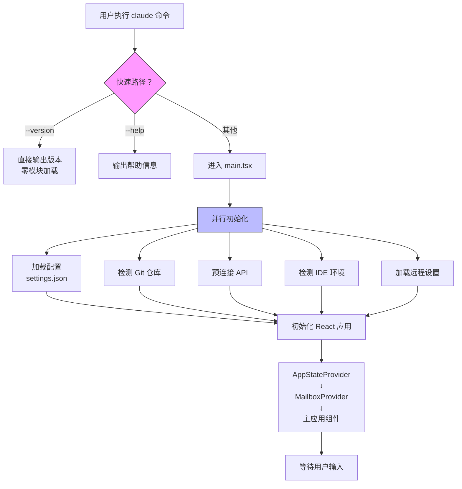
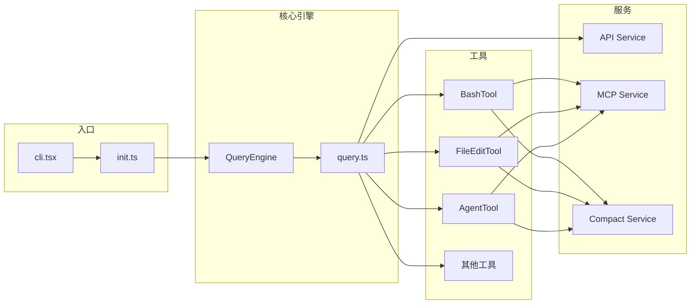
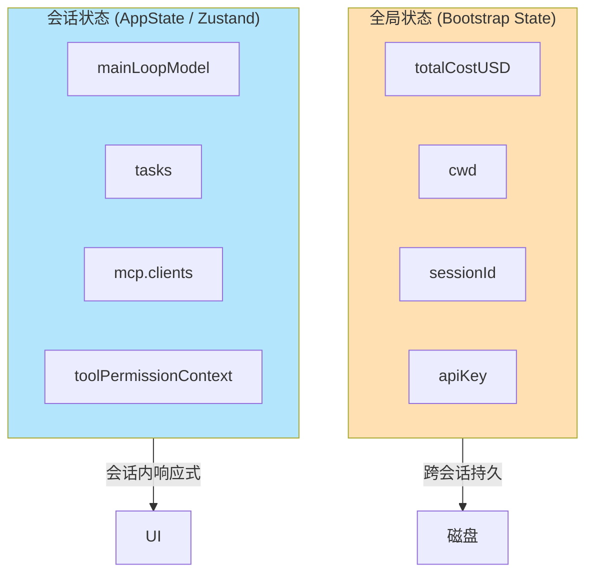
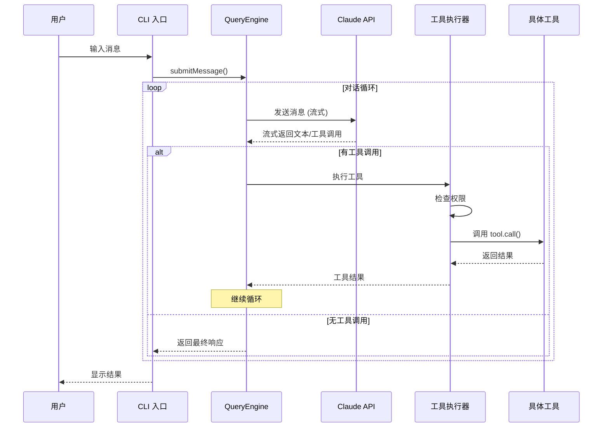

# Claude Code 整体架构设计

> 从 1884 个源文件中提炼的系统全貌，分析一个顶级 AI Agent 产品是如何组织的。

## 一、系统分层总览

Claude Code 采用**五层解耦架构**，从上到下依次为：

```mermaid
graph TB
    subgraph L0["Layer 0: 入口与启动"]
        CLI["cli.tsx<br/>动态路由 · 快速路径"]
        INIT["init.ts<br/>配置 · 认证 · 网络"]
        BOOT["bootstrap/state.ts<br/>全局单例状态"]
    end

    subgraph L1["Layer 1: UI 与交互"]
        INK["ink/<br/>终端 UI 框架"]
        COMP["components/<br/>React 组件库"]
        HOOKS["hooks/<br/>100+ React Hook"]
        STATE["state/<br/>Zustand Store"]
    end

    subgraph L2["Layer 2: 查询与协调"]
        QE["QueryEngine<br/>AI 查询主循环"]
        QUERY["query.ts<br/>对话循环 · 工具编排"]
        COORD["coordinator/<br/>多 Worker 协调"]
        CMD["commands/<br/>100+ 斜杠命令"]
    end

    subgraph L3["Layer 3: 工具层"]
        TOOLS["tools/<br/>40+ 工具实现"]
        TOOLEXEC["toolExecution.ts<br/>权限 · 进度 · Hook"]
    end

    subgraph L4["Layer 4: 服务层"]
        API["api/<br/>Claude API 封装"]
        MCP["mcp/<br/>MCP 协议集成"]
        COMPACT["compact/<br/>上下文压缩"]
        MEM["SessionMemory/<br/>记忆管理"]
    end

    subgraph L5["Layer 5: 基础设施"]
        UTILS["utils/<br/>331+ 工具函数"]
        TASKS["tasks/<br/>任务管理框架"]
        PERM["permissions/<br/>权限引擎"]
    end

    L0 --> L1
    L1 --> L2
    L2 --> L3
    L3 --> L4
    L4 --> L5
```



### 每一层在做什么？

| 层级 | 核心职责 | 定位 |
|------|---------|------|
| **Layer 0** 入口与启动 | 解析命令行参数，初始化配置、认证、网络 | 系统引导与环境准备 |
| **Layer 1** UI 与交互 | 终端界面渲染、用户输入处理、状态管理 | 用户交互界面层 |
| **Layer 2** 查询与协调 | 驱动 AI 对话循环、分发工具调用、协调多个 Agent | 核心决策与调度中枢 |
| **Layer 3** 工具层 | 40+ 种具体能力的实现（读写文件、执行命令、搜索等） | AI 的执行能力层 |
| **Layer 4** 服务层 | API 调用、MCP 集成、上下文压缩、记忆管理 | 外部对接与数据管理 |
| **Layer 5** 基础设施 | 权限检查、文件操作、任务框架等底层能力 | 底层支撑设施 |

---

## 二、启动流程

Claude Code 的启动经过精心优化，让简单命令（如 `--version`）毫秒级响应，复杂功能按需加载。



### 关键设计决策

| 决策 | 做法 | 效果 |
|------|------|------|
| **快速路径** | `--version` 在模块加载前就返回 | 毫秒级响应 |
| **并行初始化** | 配置/Git/API/IDE 检测同时进行 | 启动时间减半 |
| **延迟加载** | 命令和工具按需 import | 减少初始内存占用 |
| **特性门控** | 编译时移除未启用特性的代码 | 发布包体积更小 |

---

## 三、核心模块职责一览



| 模块 | 文件 | 职责 | 设计模式 |
|------|------|------|---------|
| **Bootstrap State** | `bootstrap/state.ts` | 全局单例，存储跨会话元数据（总成本、CWD 等） | 单例 + 不可变 API |
| **AppState** | `state/AppStateStore.ts` | 当前会话的 UI 状态（模型、任务、MCP 等） | Zustand Store + 选择器 |
| **QueryEngine** | `QueryEngine.ts` | AI 查询的可复用执行器 | 异步生成器 |
| **query.ts** | `query.ts` (1729行) | 核心对话循环：消息→API→工具→响应 | 状态机 |
| **Coordinator** | `coordinator/` | 多 Worker 协调（主-从模式） | 主从架构 |
| **toolExecution.ts** | `services/tools/` (1745行) | 工具执行编排：验证→权限→执行→Hook | 管道模式 |
| **compact** | `services/compact/` | 上下文压缩：自动/微压缩/缓存编辑 | 策略模式 |

---

## 四、两层状态管理

Claude Code 采用了"两层状态"设计，把不同生命周期的数据分开管理：



| 维度 | 全局状态 (Bootstrap) | 会话状态 (AppState) |
|------|---------------------|-------------------|
| **生命周期** | 进程级，跨会话 | 单次会话 |
| **更新方式** | 命令式 `setCwd(...)` | 响应式 `useAppState(s => ...)` |
| **用途** | 元数据、成本、CWD | UI 驱动、任务、权限 |
| **约 100 个变量** | 简单键值对 | 结构化状态树 |

---

## 五、关键数据结构

### AppState 状态树（简化版）

```
AppState
├── mainLoopModel: "claude-sonnet-4-6"       # 当前模型
├── settings: SettingsJson                    # 用户配置
├── verbose: boolean                          # 详细模式
│
├── tasks: { [id]: TaskState }                # 后台任务
│   ├── LocalAgentTask                        #   本地子 Agent
│   ├── RemoteAgentTask                       #   远程 Agent
│   └── InProcessTeammateTask                 #   团队协作
│
├── mcp                                       # MCP 服务
│   ├── clients: MCPServerConnection[]        #   已连接服务器
│   ├── tools: Tool[]                         #   MCP 工具
│   └── resources: Record<string, Resource[]> #   MCP 资源
│
├── plugins                                   # 插件
│   ├── enabled: LoadedPlugin[]
│   └── errors: PluginError[]
│
└── toolPermissionContext                      # 权限
    ├── mode: 'default' | 'auto' | 'plan'
    ├── alwaysAllowRules: {}
    └── alwaysDenyRules: {}
```

---

## 六、核心执行路径

一次用户交互从输入到输出，经过以下路径：



### 路径说明

1. **输入路径**: CLI → processUserInput → QueryEngine → query()
2. **API 路径**: query() → buildMessages → Claude API (流式) → 解析响应
3. **工具路径**: 提取 tool_use → 权限检查 → Hook → 执行 → 后处理
4. **输出路径**: 工具结果 → 作为新消息追加 → 继续循环或退出

---

## 七、特性门控与条件编译

Claude Code 支持内部（Ant）和外部两种构建，通过特性门控在编译时移除不需要的代码：

```typescript
// 编译时特性检查 — 未启用的代码会被"死代码消除"
if (feature('COORDINATOR_MODE')) {
  // 仅内部构建包含此代码
  const coordinatorMode = require('./coordinator/coordinatorMode.js')
}
```

| 特性 | 内部构建 | 外部构建 | 说明 |
|------|---------|---------|------|
| COORDINATOR_MODE | ✅ | ❌ | 多 Worker 协调模式 |
| REPL_TOOL | ✅ | ❌ | 代码 REPL |
| CACHED_MICROCOMPACT | ✅ | ❌ | 缓存微压缩 |
| MCP | ✅ | ✅ | MCP 协议 |
| PLUGINS | ✅ | ✅ | 插件系统 |

---

## 八、架构设计原则总结

| 原则 | 体现 |
|------|------|
| **渐进式初始化** | 快速路径→并行初始化→按需加载 |
| **最小全局状态** | Bootstrap ~100 变量，其余在 AppState |
| **工具是一等公民** | 统一接口，40+ 工具全部走相同管道 |
| **消息不可变** | 历史可重播，压缩可验证 |
| **流式优于批量** | 所有 API 调用默认流式，实时 UI 反馈 |
| **Hook 优于硬编码** | 所有关键节点都有可扩展的 Hook |
| **特性门控优于条件分支** | 编译时移除，零运行时开销 |
| **协调不递归** | Worker 工具受限，防止无限嵌套 |
