# Claude Code 对话与数据流

> 一条消息从用户键盘到 AI 响应的完整流转路径分析。

## 一、消息类型全景

Claude Code 中所有交互都是"消息"。理解消息类型，就理解了整个数据流。

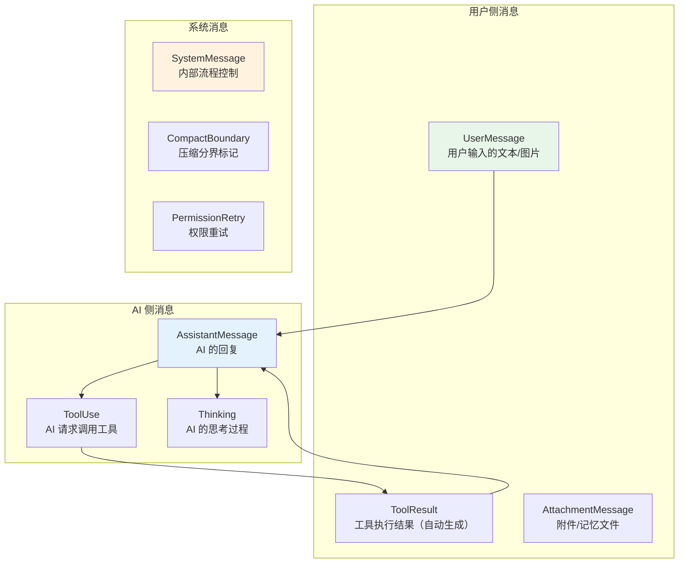

### 消息类型详解

| 消息类型 | 角色 | 包含内容 | 发送给 API？ |
|---------|------|---------|------------|
| **UserMessage** | user | 文本、图片、粘贴引用 | ✅ |
| **AssistantMessage** | assistant | 文本、工具调用、思考过程 | ✅ |
| **ToolResult** | user | 工具执行结果（stdout、文件内容等） | ✅ |
| **AttachmentMessage** | system | 记忆文件、上下文附件 | ✅ |
| **CompactBoundary** | system | 压缩分界线（标记压缩事件） | ❌ 仅内部 |
| **PermissionRetry** | system | 权限被拒后的重试标记 | ❌ 仅内部 |

---

## 二、一次完整对话的数据流

### 场景：用户输入 "列出 src 目录的文件"

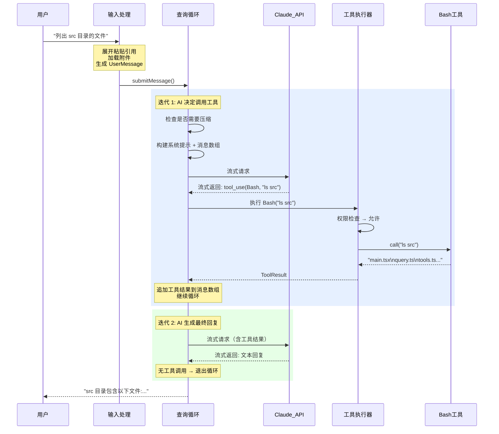

### 消息数组的变化过程

```
── 迭代 1 开始 ──
messages = [
  { role: "user", content: "列出 src 目录的文件" }
]
     ↓ API 返回
messages = [
  { role: "user",      content: "列出 src 目录的文件" },
  { role: "assistant", content: [ToolUse("Bash", "ls src")] },  ← 新增
]
     ↓ 工具执行完成
messages = [
  { role: "user",      content: "列出 src 目录的文件" },
  { role: "assistant", content: [ToolUse("Bash", "ls src")] },
  { role: "user",      content: [ToolResult("main.tsx\n...")] },  ← 新增
]

── 迭代 2 开始 ──
     ↓ API 返回最终回复
messages = [
  { role: "user",      content: "列出 src 目录的文件" },
  { role: "assistant", content: [ToolUse("Bash", "ls src")] },
  { role: "user",      content: [ToolResult("main.tsx\n...")] },
  { role: "assistant", content: [Text("src 目录包含...")] },      ← 新增
]
```

---

## 三、查询循环状态机

`query.ts` 是整个系统的心脏，它是一个**状态机驱动的循环**：

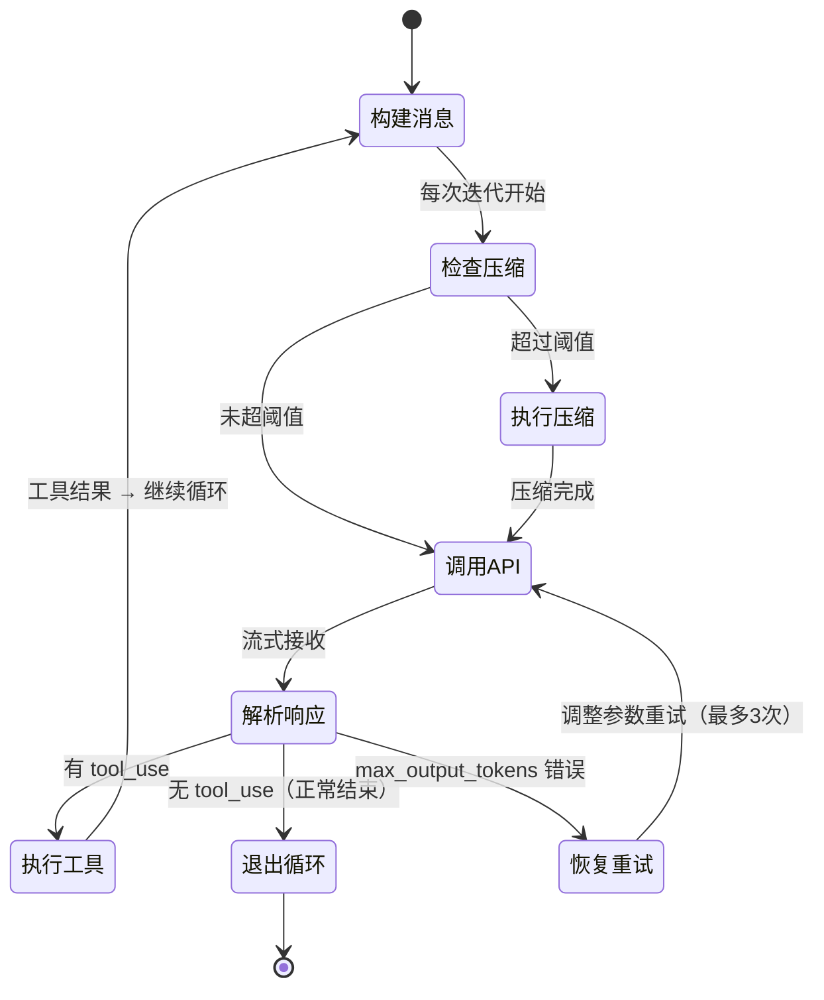

### 循环继续的5种原因

| 继续类型 | 触发条件 | 行为 |
|---------|---------|------|
| `tool_result_continue` | AI 调用了工具 | 执行工具，把结果追加到消息，继续 |
| `max_output_tokens_recovery` | 输出超长被截断 | 减少 max_tokens，重试（最多3次） |
| `compact_recovery` | 主动压缩后继续 | 压缩历史，用摘要替代，继续 |
| `reactive_compact_recovery` | prompt_too_long 错误 | 紧急压缩后重试 |
| `max_output_tokens_continue_on_error` | 错误恢复 | 尝试继续 |

---

## 四、API 交互详解

### 4.1 请求构建

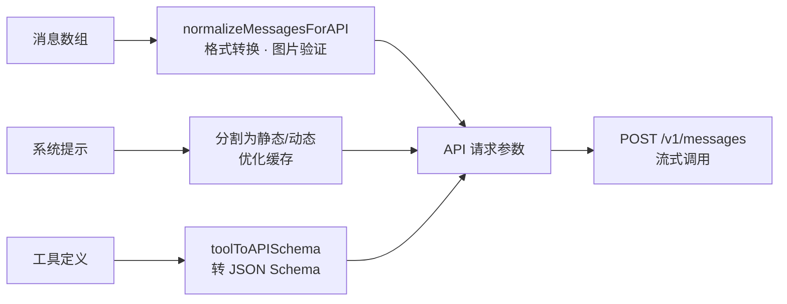

**请求参数构成**：

```
{
  model: "claude-sonnet-4-6",
  max_tokens: 32000,
  system: [
    { text: "静态指令...", cache_control: { type: "ephemeral" } },  ← 可缓存
    { text: "动态上下文..." }                                       ← 每次变化
  ],
  messages: [...],              // 转换后的消息
  tools: [...],                 // 工具 schema
  tool_choice: "auto",
  temperature: 1,
  stream: true
}
```

### 4.2 流式响应处理

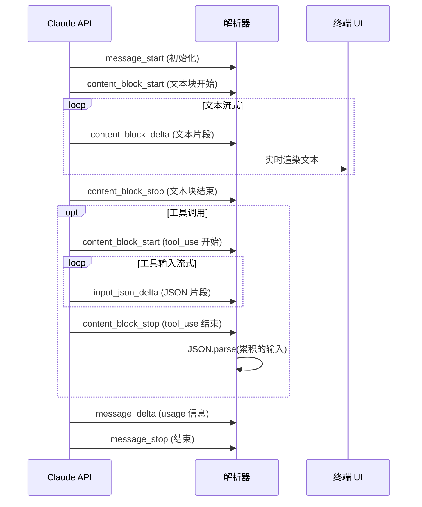

### 4.3 重试与回退

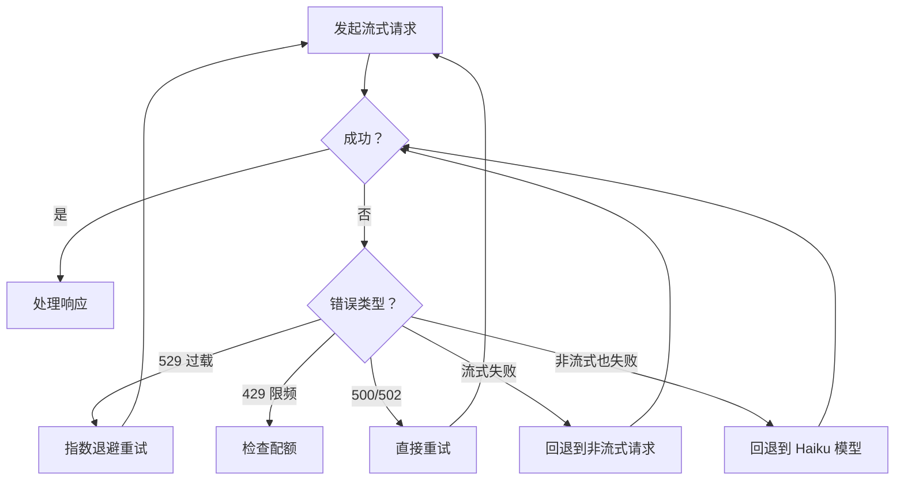

---

## 五、上下文构建策略

系统提示由**三层内容**拼接而成：

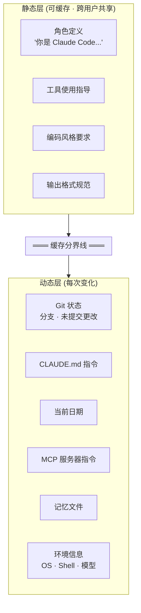

### 为什么要分两层？

**提示缓存**是 Claude API 的重要优化特性：

- **静态层**加了 `cache_control` 标记 → 跨请求复用，节省 token 费用
- **动态层**每次都不同 → 不缓存，但也不会影响静态层的缓存命中

这个设计让 Claude Code 的 API 调用成本**大幅降低**。

---

## 六、Compact 压缩机制

对话越来越长，上下文窗口终会不够用。Compact 就是"智能遗忘"机制。

### 6.1 三层压缩策略

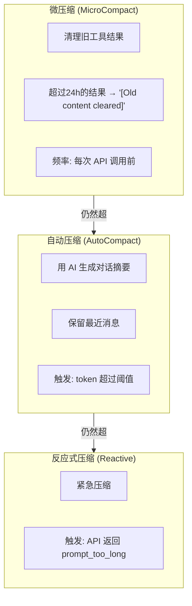

### 6.2 何时触发压缩？

```
模型上下文窗口（如 200K tokens）
│
├─── 有效窗口 = 窗口 - max_output_tokens
│    （200K - 32K = 168K）
│
├─── 自动压缩线 = 有效窗口 - 13K 缓冲
│    （168K - 13K = 155K）
│    → 超过这条线：触发完整压缩
│
├─── 警告线 = 自动压缩线 - 20K
│    （155K - 20K = 135K）
│    → 超过这条线：显示警告
│
└─── 阻塞线 = 窗口 - 3K
     （200K - 3K = 197K）
     → 超过这条线：必须先压缩才能继续
```

### 6.3 压缩后恢复

压缩不仅是"删除旧消息"，还会**恢复关键上下文**：

```
压缩完成后：
├─ 恢复最近 5 个编辑过的文件（每个最多 5K tokens）
├─ 重新注入活跃的 Skill 指令（最多 25K tokens）
├─ 附加 MCP 指令变化
└─ 总恢复预算: 50K tokens
```

---

## 七、会话持久化

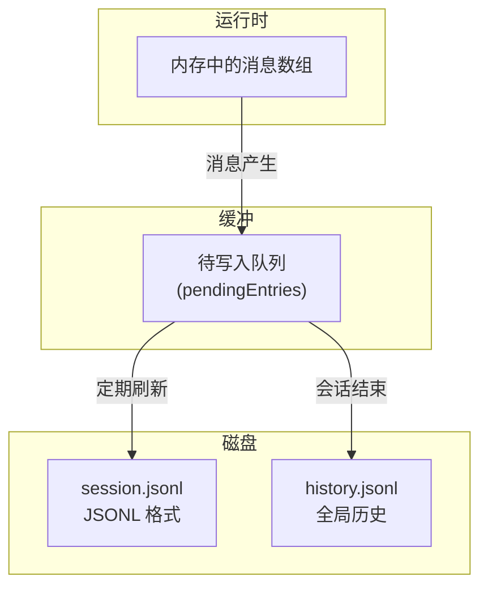

### 存储格式

每条消息作为 JSONL 文件的一行：

```json
{"timestamp":1711929600000,"sessionId":"abc-123","uuid":"msg-1","type":"user","content":{"role":"user","content":"列出文件"}}
{"timestamp":1711929601000,"sessionId":"abc-123","uuid":"msg-2","type":"assistant","content":{"role":"assistant","content":[...]}}
```

### 会话恢复 (`--resume`)

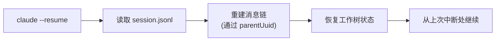

---

## 八、Token 使用与成本追踪

每次 API 调用都会记录 token 使用：

```
usage: {
  inputTokens: 1500,            // 输入 token
  outputTokens: 200,             // 输出 token
  cacheReadInputTokens: 12000,   // 缓存命中 (大幅便宜)
  cacheCreationInputTokens: 500, // 缓存写入
  costUSD: 0.0043                // 美元成本
}
```

### Token 估算策略

| 方法 | 精度 | 速度 | 用途 |
|------|------|------|------|
| **API 精确计数** | 100% | 慢（需要 API 调用） | 关键决策（是否压缩） |
| **Haiku 回退** | ~95% | 中 | API 不可用时 |
| **粗略估算** | ~80% | 极快 | 实时 UI 显示 |

粗略估算规则：
- 普通文本：**4 字节 ≈ 1 token**
- JSON 数据：**2 字节 ≈ 1 token**（JSON 更密集）
- 图片：固定 **2000 tokens**

---

## 九、错误处理全景

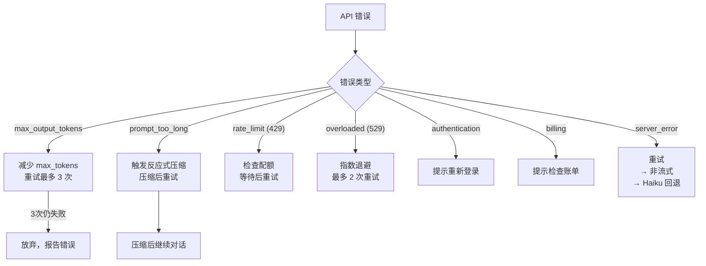

---

## 十、设计亮点总结

| 设计点 | 做法 | 为什么 |
|--------|------|--------|
| **流式优先** | 所有 API 调用默认流式 | 用户看到实时输出，体验好 |
| **状态机循环** | query.ts 用 while(true) + transition | 支持工具调用、错误恢复、压缩等多种继续方式 |
| **提示缓存二分** | 静态/动态分界线 | 最大化缓存命中率，降低成本 |
| **三级压缩** | 微压缩 → 自动压缩 → 反应式 | 渐进式应对，避免过度压缩 |
| **压缩后恢复** | 恢复最近文件和 Skill | 压缩不丢关键上下文 |
| **多级回退** | 流式 → 非流式 → Haiku | 最大化可用性 |
| **JSONL 持久化** | 行追加，无需读-改-写 | 原子写入，不怕崩溃 |
