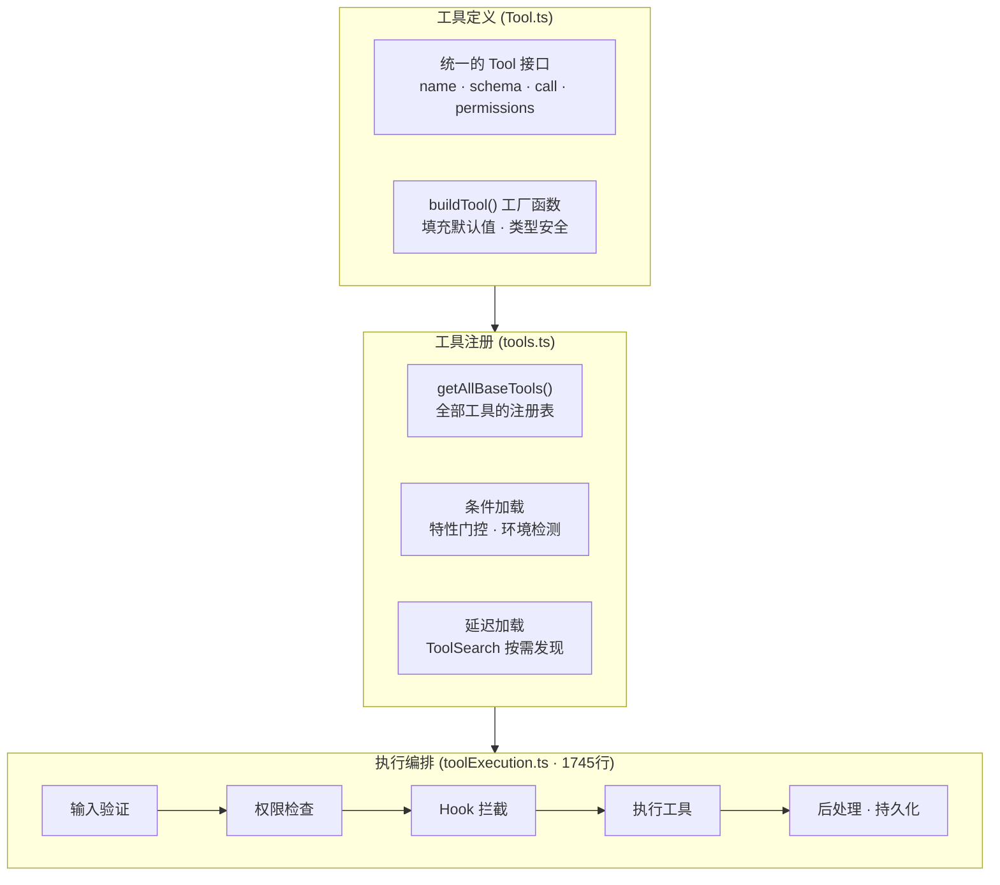
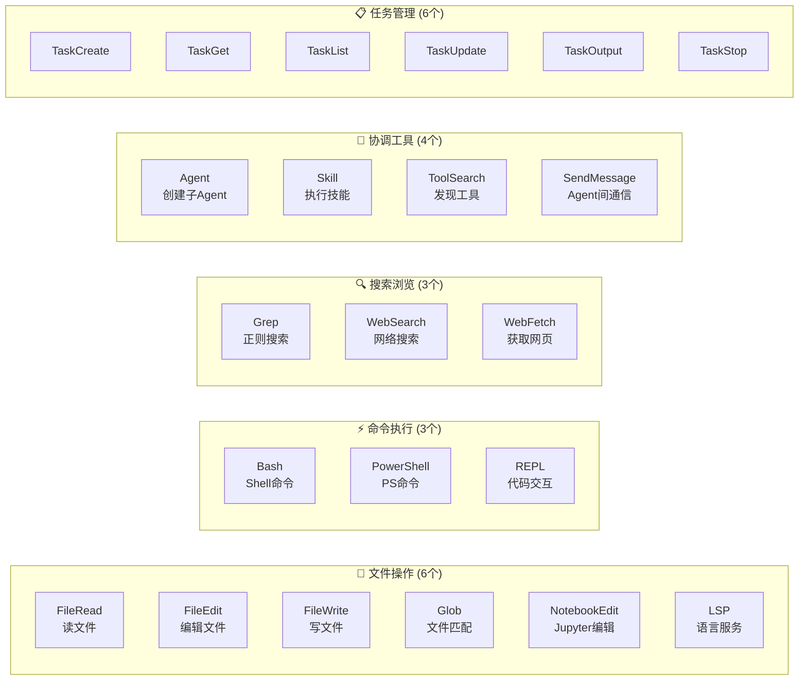
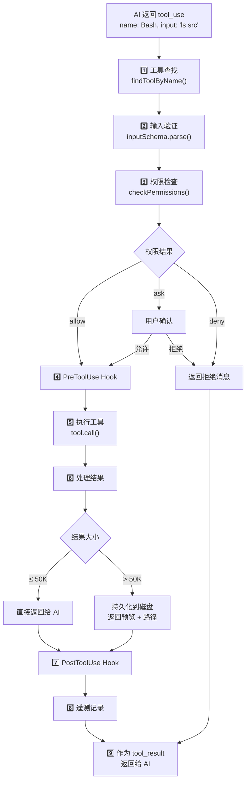
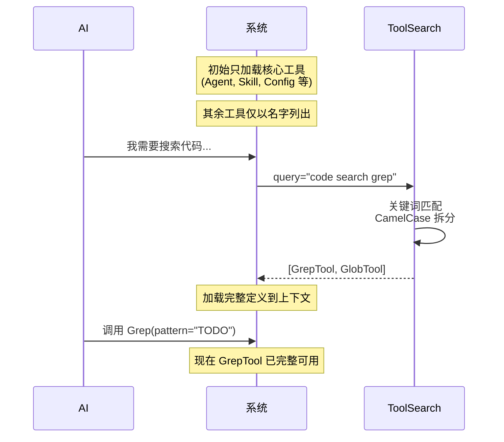
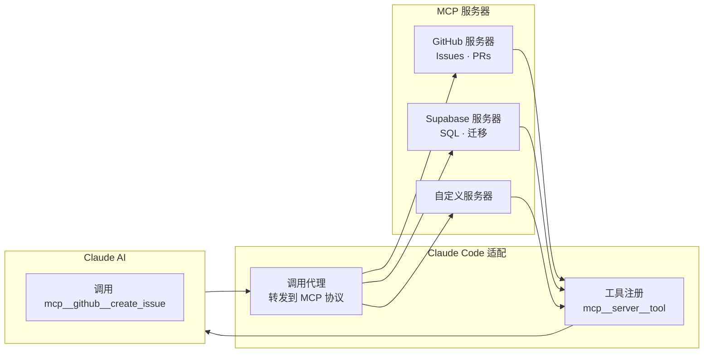
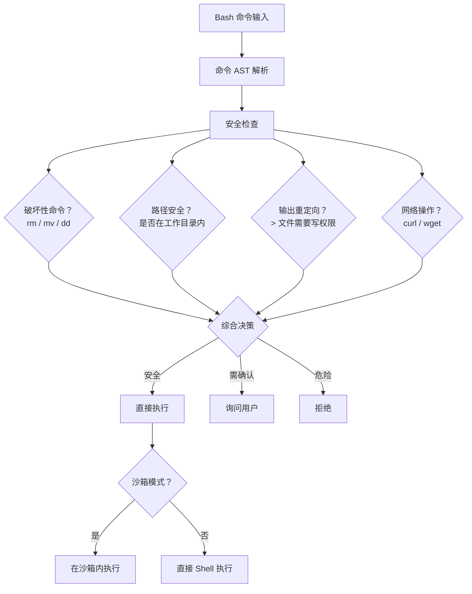
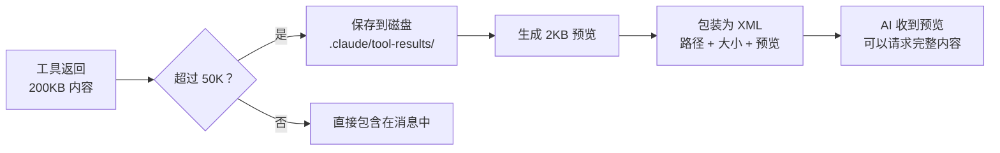

# Claude Code 工具系统

> AI Agent 的能力边界取决于它能调用什么工具。以下分析 Claude Code 如何定义、注册、调用和管控 40+ 种内置工具及动态扩展的 MCP 工具。

## 一、工具系统全景



---

## 二、一个工具长什么样？

每个工具都遵循统一的 `Tool` 接口，结构如下：

```
┌──────────────────────────────────────────┐
│              Tool 接口                    │
├──────────────────────────────────────────┤
│  📛 身份                                 │
│  ├─ name: 工具名（如 "Bash"）            │
│  ├─ description: 给 AI 看的说明          │
│  └─ searchHint: ToolSearch 的搜索关键词   │
│                                          │
│  📥 输入输出                             │
│  ├─ inputSchema: Zod 参数验证            │
│  └─ outputSchema: 结果类型               │
│                                          │
│  ⚡ 执行                                 │
│  └─ call(args, context): 核心执行逻辑    │
│                                          │
│  🔒 安全                                 │
│  ├─ checkPermissions(): 权限检查         │
│  ├─ isReadOnly(): 是否只读               │
│  ├─ isDestructive(): 是否有破坏性        │
│  └─ isConcurrencySafe(): 是否可并行      │
│                                          │
│  🎨 UI 展示                              │
│  ├─ renderToolUseMessage(): 调用时展示   │
│  ├─ renderToolResultMessage(): 结果展示  │
│  └─ renderToolUseProgressMessage(): 进度 │
│                                          │
│  📦 结果管理                             │
│  └─ maxResultSizeChars: 超过则持久化     │
└──────────────────────────────────────────┘
```

### 工厂函数的安全默认值

```typescript
buildTool(定义) → 填充以下默认值:
  isEnabled:          true      // 默认启用
  isConcurrencySafe:  false     // 假设不安全（保守）
  isReadOnly:         false     // 假设有写操作（保守）
  isDestructive:      false     // 默认非破坏性
  checkPermissions:   → allow   // 但专业工具会覆盖
```

> **安全第一原则**：默认值总是偏保守的。`isConcurrencySafe` 默认为 `false`，意味着除非工具明确声明安全，否则不会并行执行。

---

## 三、工具分类大全

### 按功能分类



### 按权限级别分类

| 级别 | 工具 | 行为 |
|------|------|------|
| **只读** | FileRead, Grep, Glob, WebSearch, LSP | 不修改任何状态，自动允许 |
| **写受限** | FileEdit, FileWrite, Bash | 需要权限规则或用户确认 |
| **破坏性** | Bash(rm/mv), FileEdit(覆盖) | 高风险，默认询问 |
| **Pass-through** | MCP 工具 (60+) | 委托给通用权限系统 |
| **受限执行** | Agent, Skill | 创建隔离的子上下文 |

---

## 四、一次工具调用的完整生命周期



### 各步骤详解

| 步骤 | 做什么 | 关键细节 |
|------|--------|---------|
| **1. 工具查找** | 根据名称找到工具实例 | 支持别名、MCP 工具名转换 |
| **2. 输入验证** | Zod schema 验证 + 工具特定检查 | FileEdit 检查文件是否存在 |
| **3. 权限检查** | 规则匹配 → Hook → 分类器 → UI | 多层检查，见安全章节 |
| **4. Pre Hook** | 用户自定义拦截 | 可修改输入或阻止执行 |
| **5. 执行** | 调用 tool.call() | 支持进度回调、异步 |
| **6. 结果处理** | 大结果持久化到磁盘 | 50K 字符阈值 |
| **7. Post Hook** | 用户自定义后处理 | 可修改输出 |
| **8. 遥测** | 记录执行时间、token、错误 | 用于分析和优化 |
| **9. 返回** | 构造 tool_result 消息 | 包含在下一次 API 调用中 |

---

## 五、延迟加载机制 (ToolSearch)

### 问题

40+ 内置工具加上 MCP 动态工具的完整描述会占用大量 token，浪费上下文窗口。

### 解决方案



### 两类工具

| 类型 | 例子 | 初始行为 |
|------|------|---------|
| **始终加载** (alwaysLoad) | Agent, Skill, Config, Brief | 完整描述始终在系统提示中 |
| **延迟加载** (deferred) | Bash, FileEdit, Grep, WebSearch | 仅名字列出，通过 ToolSearch 按需加载 |

### 搜索策略

```
ToolSearch("select:BashTool")     → 精确选择
ToolSearch("code search grep")    → 关键词匹配
ToolSearch("notebook jupyter")    → 关键词 + 排序
```

匹配逻辑：
- 工具名 CamelCase 拆分（`FileEditTool` → `file`, `edit`, `tool`）
- MCP 工具名拆分（`mcp__server__action` → 各部分）
- 匹配 `searchHint` 字段

---

## 六、MCP 工具集成

MCP (Model Context Protocol) 允许外部服务器为 Claude Code 提供额外工具。



### 命名规范

```
MCP 服务器原始名: create_issue (来自 GitHub 服务器)
     ↓ 转换
Claude Code 中:   mcp__github__create_issue

格式: mcp__{服务器名}__{工具名}
```

### MCP 工具的特殊之处

| 特性 | 本地工具 | MCP 工具 |
|------|---------|---------|
| **注册** | 编译时静态 | 运行时动态（连接/断开） |
| **权限** | 工具自带 checkPermissions | Pass-through（委托通用系统） |
| **数量** | 40+ 固定 | 动态可扩展 |
| **输出** | 结构化 TypeScript | structuredContent + _meta |

---

## 七、重点工具深入

### BashTool — 最复杂的工具

BashTool 的实现高达 **160KB**，因为 Shell 命令的安全检查极其复杂：



### AgentTool — 子 Agent 工具

AgentTool 可以创建独立的子 Agent 来完成复杂任务：

```
AgentTool({
  description: "搜索认证代码",      // 3-5 字简述
  prompt: "在 src/auth 中搜索...",  // 完整任务
  subagent_type: "Explore",         // 可选：专门化类型
  model: "sonnet",                   // 可选：模型覆盖
  run_in_background: true,           // 可选：后台执行
  isolation: "worktree",             // 可选：Git 工作树隔离
})
```

### FileEditTool — 精确编辑

```
FileEditTool({
  file_path: "/src/app.ts",
  old_string: "function foo()",     // 精确匹配要替换的文本
  new_string: "function bar()",     // 替换为新文本
  replace_all: false                // 默认只替换第一个匹配
})
```

安全特性：
- 检查 old_string 在文件中**唯一**（避免误替换）
- 保留引号样式
- 阻止在团队内存文件中写入秘密

---

## 八、工具结果管理

### 大结果持久化

当工具结果超过阈值时，自动保存到磁盘：



### 工具结果摘要

对于工具批次，会用 Haiku 模型生成简短摘要（≤30字符）：

```
摘要示例：
├─ "Searched in auth/"
├─ "Fixed NPE in UserService"
├─ "Created signup endpoint"
├─ "Read config.json"
└─ "Ran failing tests"
```

用途：移动端进度显示、高层日志。

---

## 九、工具的行为控制

| 属性 | 含义 | 示例 |
|------|------|------|
| `interruptBehavior()` | 用户中断时的行为 | Bash: `cancel`（可中断）<br/>Agent: `block`（等完成） |
| `isOpenWorld(input)` | 是否访问外部网络 | WebSearch: `true`<br/>Grep: `false` |
| `isConcurrencySafe(input)` | 是否可并行执行 | Grep: `true`<br/>Bash: `false` |
| `inputsEquivalent(a, b)` | 检测重复调用 | 两次 Grep 相同 pattern → 跳过 |
| `isResultTruncated(output)` | 结果是否被截断 | 控制 UI 是否显示"点击展开" |

---

## 十、设计亮点总结

| 设计点 | 做法 | 为什么 |
|--------|------|--------|
| **统一抽象** | 所有工具共享同一个 Tool 接口 | 一套管道（权限/Hook/遥测）适用所有工具 |
| **安全默认** | `isReadOnly=false`, `isConcurrencySafe=false` | 未声明的能力默认受限 |
| **延迟加载** | ToolSearch 按需发现 | 省上下文窗口，省 token |
| **大结果拆分** | 超过阈值 → 磁盘 + 预览 | 防止上下文溢出 |
| **三层验证** | Zod Schema → validateInput → checkPermissions | 从格式到语义到安全，层层把关 |
| **可观测性** | 进度回调 + Hook + 遥测 | 每个工具都天然可监控 |
| **可扩展** | 新工具只需 buildTool() + 注册 | 自动获得权限/Hook/进度等能力 |
