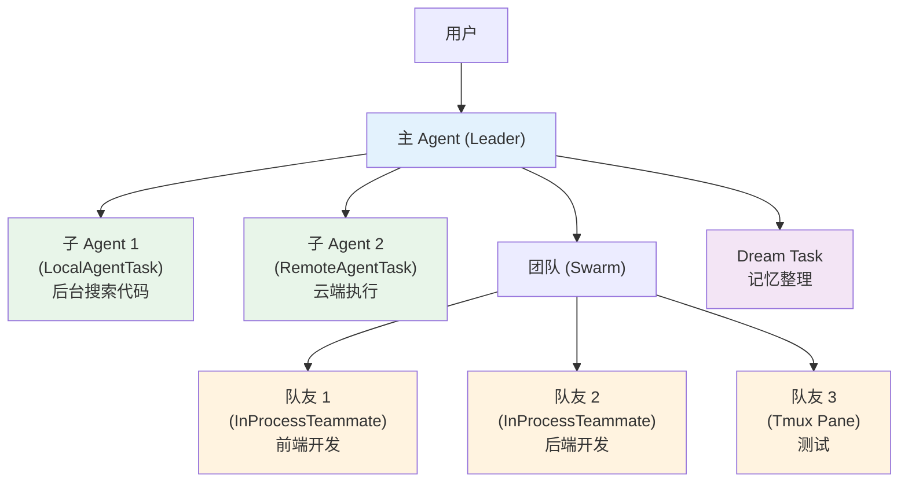
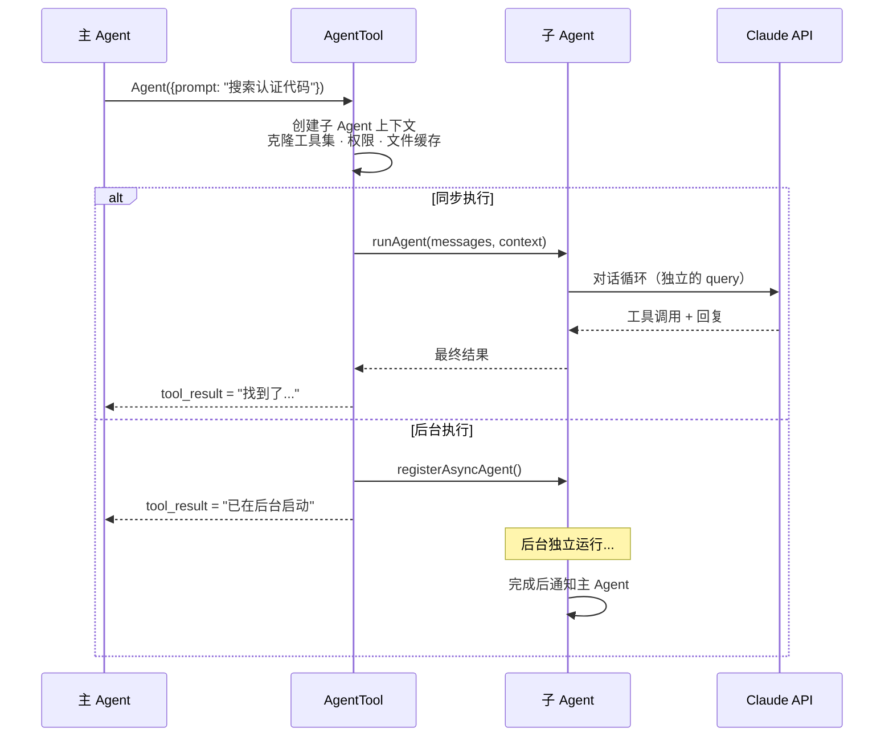
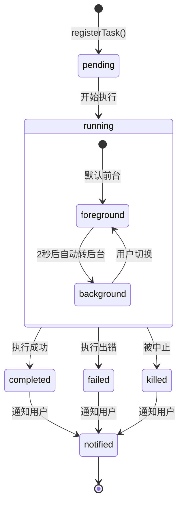
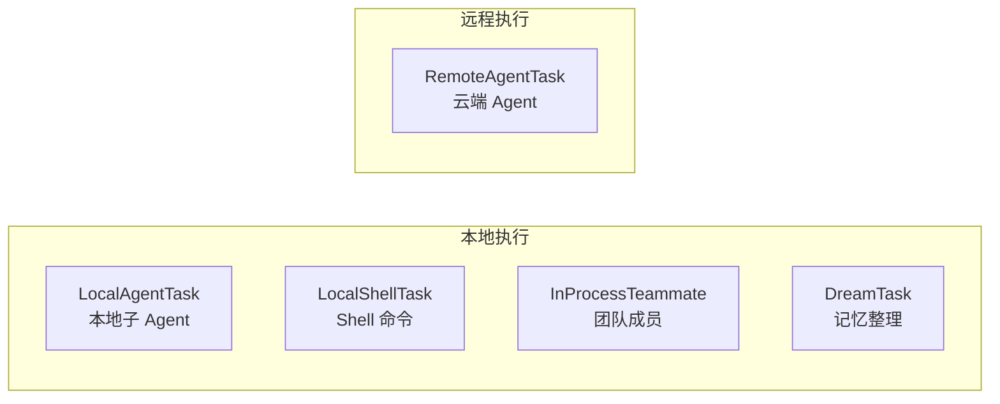
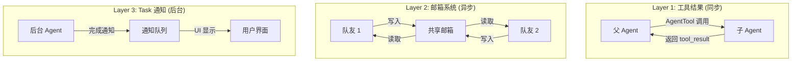
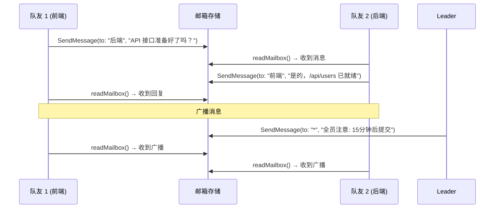
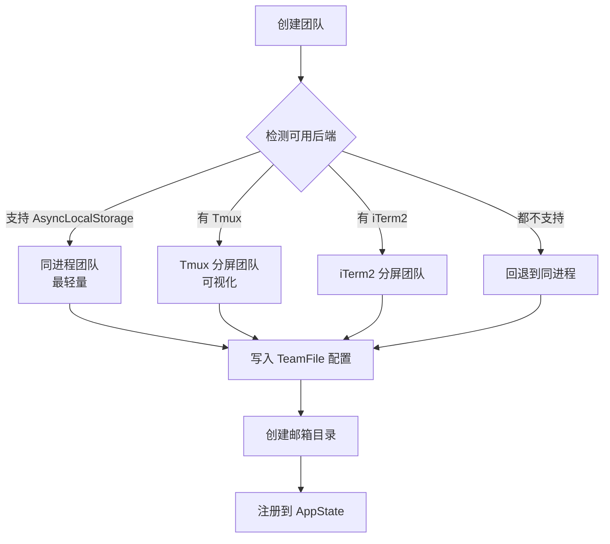
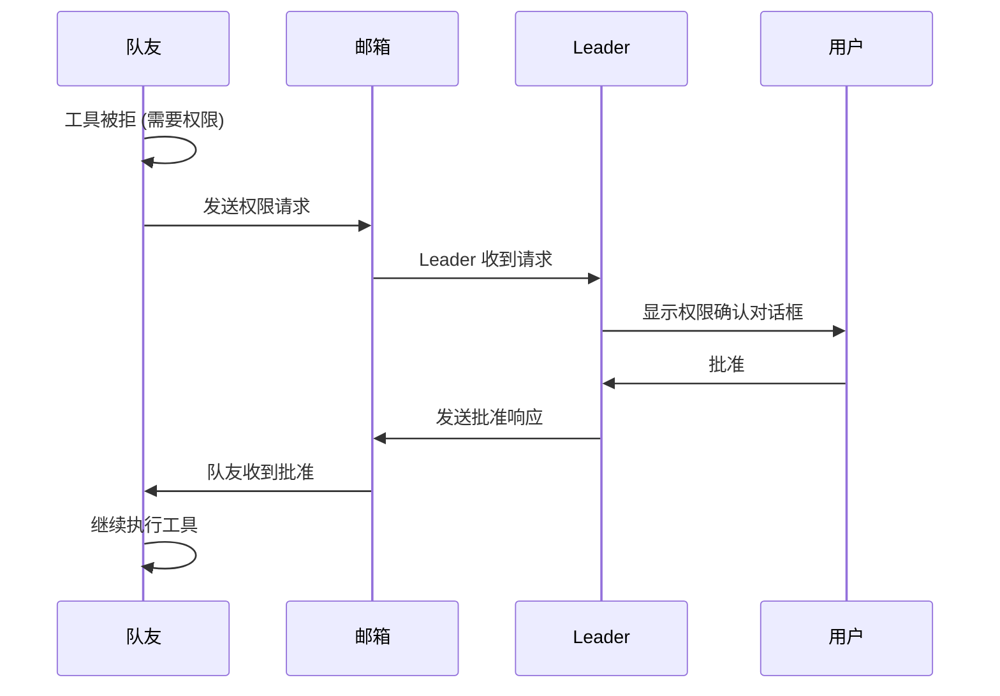
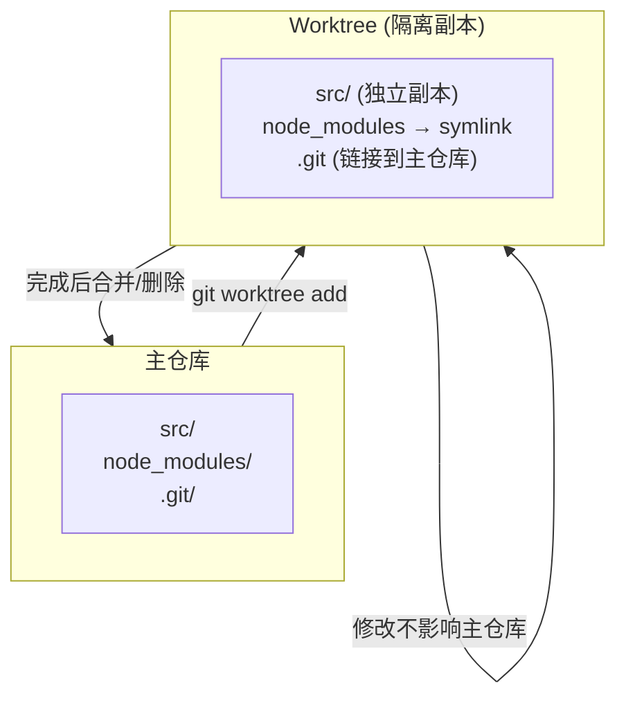
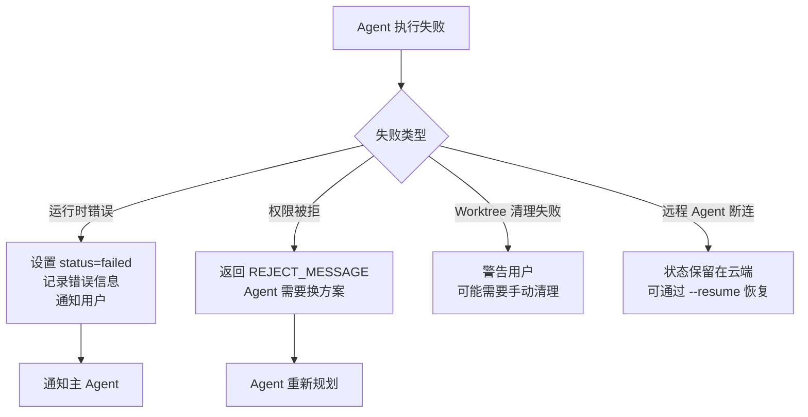

# Claude Code 多 Agent 协作机制

> 分析 Claude Code 如何实现多 Agent 的创建、通信、协调与隔离。

## 一、多 Agent 系统全景

Claude Code 实现了**三层 Agent 模型**，支持从简单的子任务到复杂的团队协作：



### 三层模型对比

| 层级 | 类型 | 隔离方式 | 通信方式 | 使用场景 |
|------|------|---------|---------|---------|
| **子 Agent** | LocalAgentTask | 同进程，独立上下文 | 工具结果 (同步) | 单个子任务 |
| **远程 Agent** | RemoteAgentTask | 云端独立进程 | 轮询 (异步) | 重资源任务 |
| **团队协作** | InProcessTeammate | AsyncLocalStorage | 邮箱 (异步) | 并行工作流 |

---

## 二、子 Agent 的创建与执行

### 2.1 创建流程



### 2.2 上下文继承

子 Agent 从父 Agent 继承：

```
父 Agent
  ├── 工具集 → 子 Agent (可能被过滤)
  ├── MCP 服务器 → 子 Agent (加上自定义的)
  ├── 系统提示（字节级相同）→ 子 Agent (优化缓存命中)
  ├── 权限模式 → 子 Agent
  ├── 文件状态缓存 → 子 Agent (克隆)
  └── 模型 → 子 Agent (可覆盖)
```

**提示缓存优化**：子 Agent 的系统提示与父 Agent 字节级相同，只在末尾追加子任务指令。这样 Claude API 的提示缓存可以**跨父子复用**，大幅降低成本。

### 2.3 Worker 工具受限

子 Agent 不能使用某些工具，防止"无限套娃"：

```
主 Agent 可用:          子 Agent 不可用:
├─ AgentTool ✅         ├─ AgentTool ❌ (防止递归)
├─ TeamCreate ✅        ├─ TeamCreate ❌
├─ TeamDelete ✅        ├─ TeamDelete ❌
├─ SendMessage ✅       ├─ SendMessage ❌ (除非是团队模式)
└─ 其他工具 ✅          └─ 其他工具 ✅
```

---

## 三、Task 生命周期

每个后台 Agent 都作为一个 Task 被管理，有完整的生命周期：



### Task 状态结构

```
TaskState
├── id: "task-abc123"
├── type: "local_agent" | "remote_agent" | "in_process_teammate"
├── status: "pending" | "running" | "completed" | "failed" | "killed"
├── prompt: "搜索 src/auth 中的认证逻辑"
├── isBackgrounded: true
├── progress:
│   ├── toolUseCount: 5
│   ├── tokenCount: 12000
│   ├── lastActivity: "Reading auth/login.ts"
│   └── summary: "Searched auth module"   ← 每30秒 AI 生成
├── result: "找到了 3 个认证相关文件..."
└── messages: [...对话历史...]
```

---

## 四、五种 Task 类型



| Task 类型 | 执行方式 | 生存期 | 关键特点 |
|-----------|---------|--------|---------|
| **LocalAgentTask** | 同进程，异步 | 随主进程 | 可后台化，有进度追踪 |
| **RemoteAgentTask** | 云端独立进程 | 可超过会话 | 可恢复，有审计轨迹 |
| **InProcessTeammate** | 同进程，AsyncLocalStorage | 随 Leader | 团队感知，邮箱通信 |
| **DreamTask** | 后台子 Agent | 周期性 | 记忆压缩，不中断主流程 |
| **LocalShellTask** | 直接 Shell | 进程退出时结束 | 流式输出，超时管理 |

---

## 五、Agent 间通信机制

### 三层通信模型



### 邮箱系统详解



**邮箱目录结构**：
```
teams/exploration/
├── mailboxes/
│   ├── leader.jsonl      ← Leader 的收件箱
│   ├── researcher.jsonl  ← 研究员的收件箱
│   └── validator.jsonl   ← 验证员的收件箱
```

### 结构化消息类型

除了普通文本，还支持协议级消息：

| 消息类型 | 用途 | 示例 |
|---------|------|------|
| **普通文本** | 任务交流 | "API 接口准备好了" |
| **shutdown_request** | 请求关闭 | Leader → 全员: "任务完成" |
| **shutdown_response** | 关闭确认 | 队友 → Leader: "确认关闭" |
| **plan_approval_response** | 计划审批 | Leader → 队友: "计划已批准" |

---

## 六、团队协作 (Swarm)

### 6.1 团队创建



### 6.2 团队配置文件 (TeamFile)

```json
{
  "name": "exploration",
  "leadAgentId": "leader@exploration",
  "members": [
    {
      "agentId": "researcher@exploration",
      "cwd": "/project/src",
      "model": "sonnet"
    },
    {
      "agentId": "validator@exploration",
      "cwd": "/project/tests",
      "model": "haiku"
    }
  ],
  "teamAllowedPaths": ["/project/src", "/project/tests"],
  "subscriptions": []
}
```

### 6.3 权限同步

团队成员需要工具权限时，必须请求 Leader 批准：



---

## 七、Worktree 隔离

为了防止多个 Agent 同时修改文件导致冲突，可以使用 Git Worktree 隔离：



### Worktree 生命周期

```
1. 创建:
   Agent(isolation="worktree")
   → git worktree add .claude/worktrees/{name}
   → symlink node_modules (避免重复安装)
   → 切换 CWD 到 worktree

2. 执行:
   Agent 在 worktree 中自由修改
   → 不影响主仓库
   → 不影响其他 Agent

3. 完成:
   → 如果有改动: 返回 worktree 路径和分支名
   → 如果无改动: 自动清理 worktree

4. 恢复 (--resume):
   → 从磁盘读取 worktreeState.json
   → 恢复 CWD 到 worktree
```

### 安全措施

```
路径验证:
├─ 拒绝 "..", "." 等路径穿越
├─ 仅允许 [a-zA-Z0-9._-/]
├─ 最大 64 字符
└─ 嵌套深度有限
```

---

## 八、进度追踪与摘要

### 8.1 实时进度

每个后台 Agent 都有进度追踪：

```
progress = {
  toolUseCount: 5,                    // 已调用工具次数
  tokenCount: 12000,                  // 已消耗 token
  lastActivity: "Reading auth.ts",    // 当前在做什么
  recentActivities: [                 // 最近 5 个活动
    "Grep: pattern=TODO",
    "Read: src/auth/login.ts",
    ...
  ]
}
```

### 8.2 AI 生成摘要

每 **30 秒**，系统会用 AI 为后台 Agent 生成一个 3-5 词的摘要：

```
摘要生成:
  1. 读取 Agent 当前对话记录
  2. 创建一个"只能读不能写"的微型子 Agent
  3. 让它生成简短摘要
  4. 显示在 UI 的 Task 面板中

示例摘要:
  "Searched auth module"
  "Fixed type errors"
  "Running unit tests"
```

---

## 九、失败处理与恢复



### 会话恢复

```
claude --resume
  │
  ├─ 恢复远程 Agent 状态
  │  └─ listRemoteAgentMetadata()
  │
  ├─ 恢复 Worktree CWD
  │  └─ getCurrentWorktreeSession()
  │
  ├─ 恢复团队上下文
  │  └─ readTeamFile()
  │
  └─ 从磁盘恢复对话记录
     └─ 通过 UUID 合并 sidechain 消息
```

---

## 十、资源管理

### 内存管理

- 每个同进程 Agent 约 **20MB RSS**
- 消息 UI 上限: **50 条/任务**（防止内存爆炸）
- 已结束任务 **5 秒后**从 UI 中移除

### Token 管理

```
提示缓存穿透:
  父 Agent 的系统提示 → 子 Agent 完全复用
  → Cache hit rate 极高
  → 子 Agent 的"固定成本"很低

每个 Agent 的 token 使用独立追踪:
  tracker = {
    latestInputTokens: 4500,
    cumulativeOutputTokens: 1200,
    toolUseCount: 3
  }
```

---

## 十一、设计亮点总结

| 设计点 | 做法 | 为什么 |
|--------|------|--------|
| **三层模型** | 子Agent / 远程 / 团队 | 匹配不同复杂度的需求 |
| **工具受限** | Worker 不能创建子 Agent | 防止无限递归 |
| **缓存穿透** | 父子系统提示字节级相同 | 大幅降低 API 成本 |
| **邮箱通信** | 异步 JSONL 邮箱 | 解耦，支持离线消息 |
| **Worktree 隔离** | Git worktree + symlink | 文件级隔离，不重复安装依赖 |
| **权限同步** | 队友→Leader→用户 | 安全控制不绕过 |
| **AI 进度摘要** | 每30秒 Haiku 生成 | 用户知道后台在做什么 |
| **AsyncLocalStorage** | 同进程但上下文隔离 | 轻量级隔离，无进程开销 |
