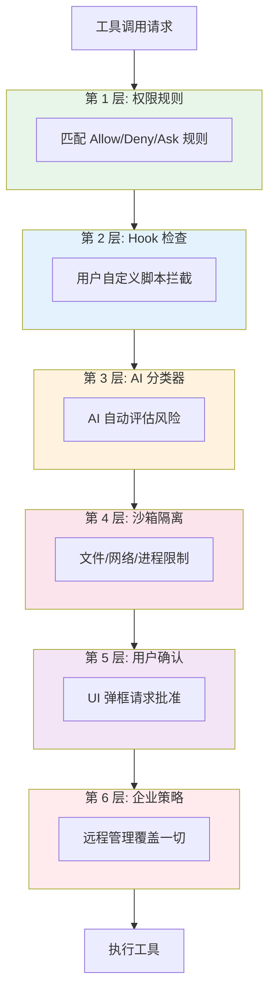
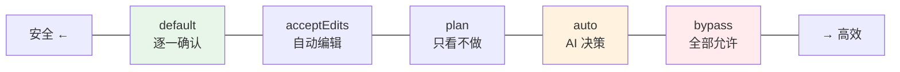
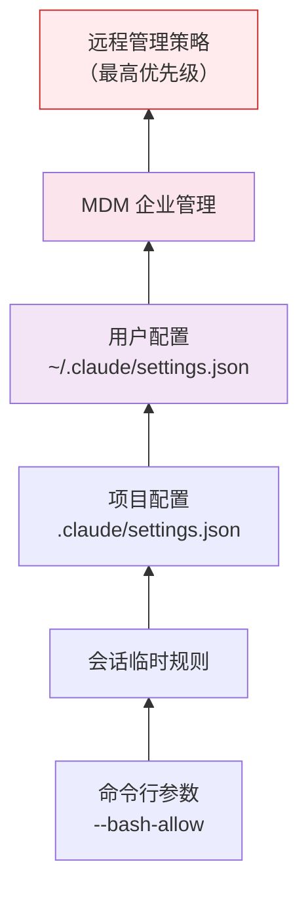
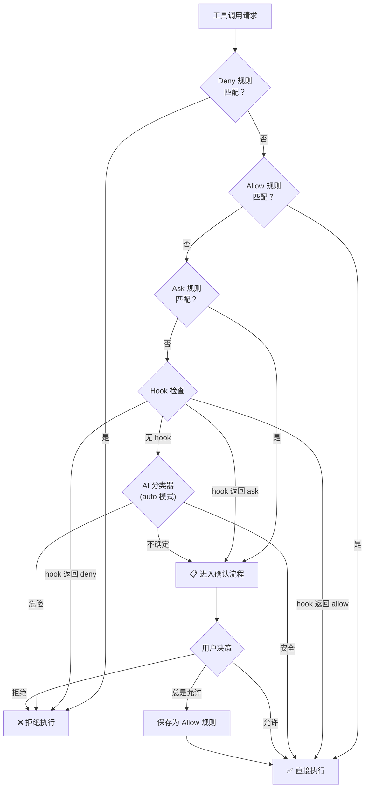
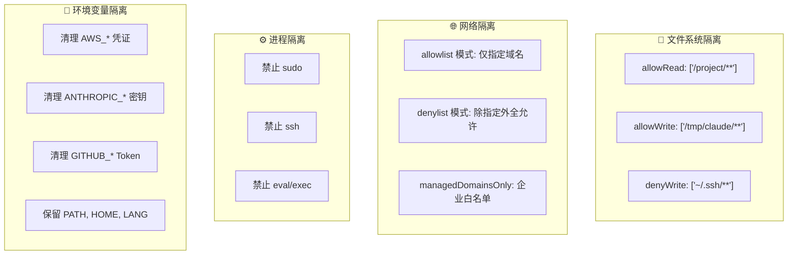
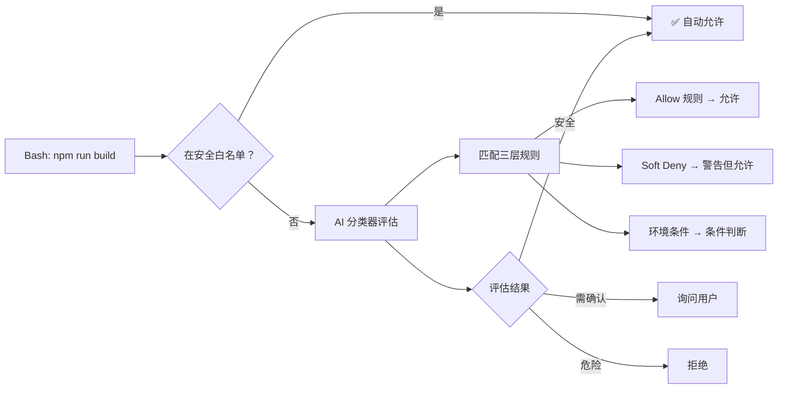
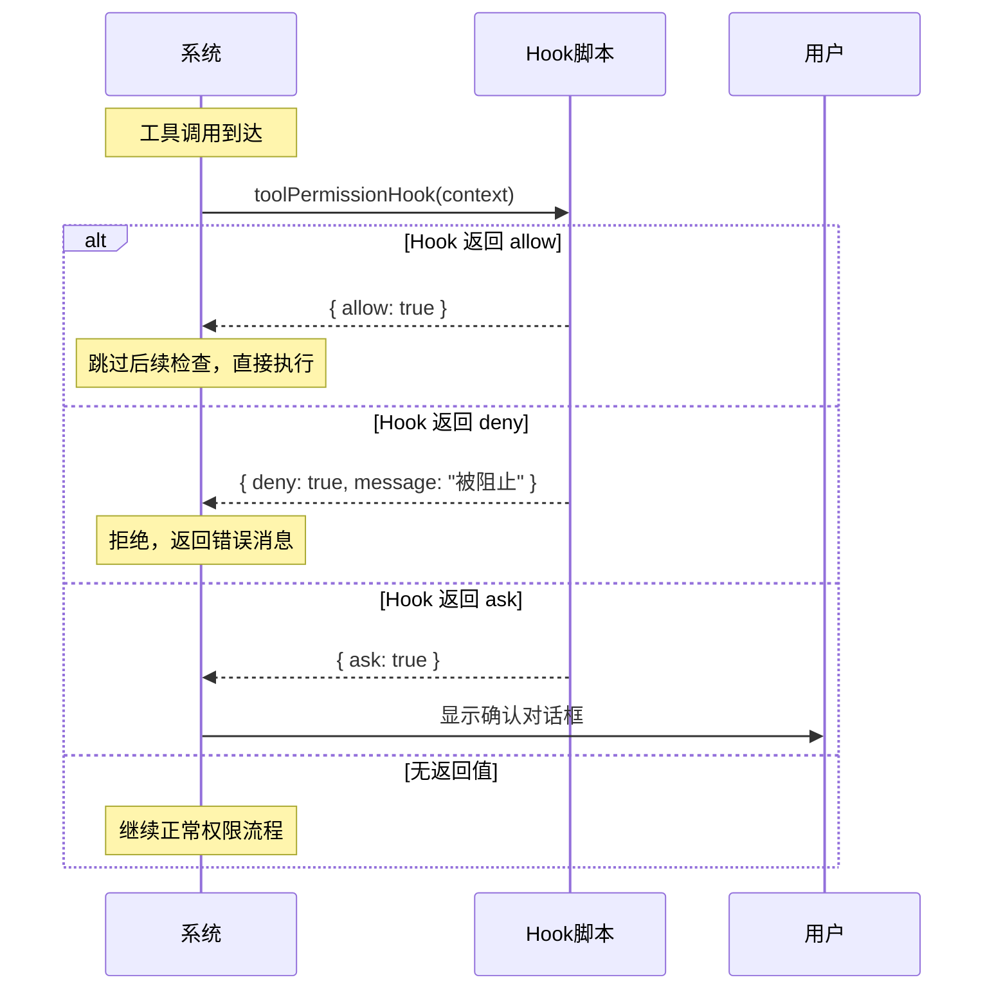
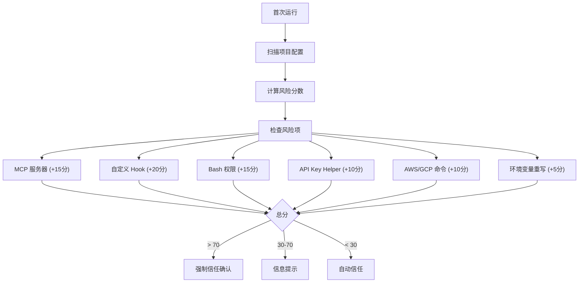
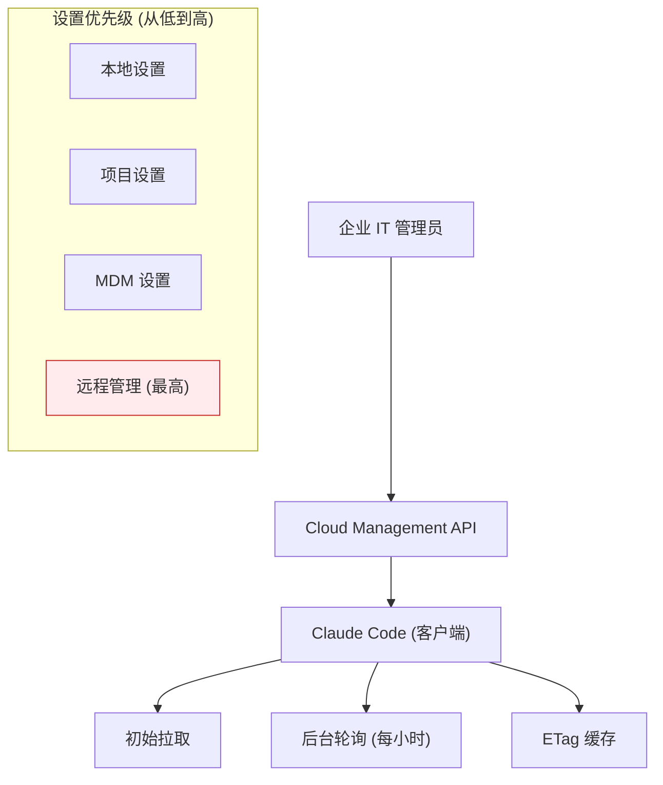
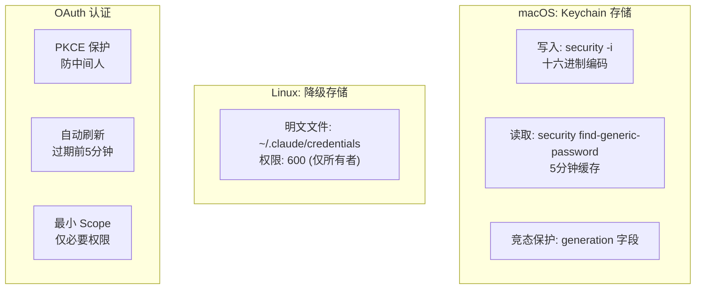

# Claude Code 安全与权限策略

> AI 能力越强，安全越重要。以下分析 Claude Code 如何实现"既强大又可控"的安全体系。

## 一、安全架构总览

Claude Code 采用**六层纵深防御**，每一层独立工作，任何一层都能阻止危险操作：



---

## 二、权限模式

Claude Code 定义了 **6 种权限模式**，形成安全性梯度：

| 模式 | 行为 | 风险 | 适用场景 |
|------|------|------|---------|
| **default** | 每个操作都问用户 | 最低 | 首次使用、敏感项目 |
| **acceptEdits** | 自动接受文件编辑，其他询问 | 低-中 | 日常开发 |
| **plan** | 只看不做，展示计划 | 低 | 审查方案 |
| **auto** | AI 分类器自动决策 | 中 | 高效工作 |
| **bypassPermissions** | 全部自动允许 | 高 | 受信环境 |
| **dontAsk** | 全部自动拒绝 | — | 完全隔离 |



---

## 三、权限规则系统

### 3.1 规则三要素

每条权限规则由三个部分组成：

```
规则 = 来源 + 行为 + 匹配条件

示例:
  ┌──────────────┬─────────┬──────────────────────┐
  │ 来源          │ 行为     │ 匹配条件              │
  ├──────────────┼─────────┼──────────────────────┤
  │ userSettings │ allow   │ Bash(git *)          │
  │ projectSettings │ deny │ Bash(sudo:*)         │
  │ session      │ ask     │ FileEdit(package.json)│
  └──────────────┴─────────┴──────────────────────┘
```

### 3.2 规则来源优先级

优先级从低到高排列，**高优先级的规则覆盖低优先级**：



### 3.3 同优先级内的决策顺序

```
同一优先级内:
  Deny 规则 > Ask 规则 > Allow 规则

也就是说，"拒绝"总是优先于"允许"。
```

### 3.4 规则匹配语法

```
工具级:       Bash                     → 匹配所有 Bash 命令
前缀匹配:     Bash(git:*)              → 匹配 git 开头的命令
通配符:       Bash(npm *)              → 匹配 npm 加任何参数
MCP 服务器:   mcp__github              → 匹配整个 GitHub MCP
MCP 工具:     mcp__github__create_issue → 匹配特定 MCP 工具
文件路径:     FileEdit(./src/**)       → 匹配 src 目录下的编辑
```

---

## 四、权限检查完整流程



---

## 五、沙箱机制

沙箱通过**四个维度**隔离 Agent 的执行环境：



### 文件路径配置语法

```
/path         → 相对于设置文件目录
//path        → 绝对路径（双斜杠）
~/path        → 用户主目录
./path        → 当前工作目录

特殊规则:
  ! 前缀      → 在允许列表中创建例外（deny-within-allow）
  
例子:
  allowWrite: ["/tmp/**"]           → 允许写 /tmp
  denyWrite:  ["!${SETTINGS_DIR}"]  → 但禁止写设置目录
```

### 安全防护

```
Symlink 防护:  realpath() 解析所有符号链接，防止"链接逃逸"
路径穿越防护:  ../../../etc/passwd → 直接拒绝
Glob 展开:    /path/*/config.* → 每个匹配路径都单独验证
输出重定向:    echo "data" > file → 检查 file 的写权限
```

---

## 六、AI 分类器 (Auto 模式)

在 Auto 模式下，AI 分类器自动判断工具调用是否安全：

### 安全白名单（不需要分类）

```
自动放行的工具:
├─ FileRead      ← 只读
├─ Grep, Glob    ← 搜索
├─ TodoWrite     ← 元数据
├─ AskUserQuestion ← 交互
├─ Sleep         ← 无副作用
└─ 其他只读工具
```

### 分类器工作原理



### 危险命令模式检测

进入 Auto 模式时，以下类型的权限规则会被**自动移除**（因为它们太宽泛）：

```
自动移除的危险规则:
├─ python:*    ← 可执行任意 Python
├─ node:*      ← 可执行任意 JS
├─ sh:* / bash:* ← Shell 脚本
├─ eval:*      ← 代码注入风险
├─ ssh:*       ← 远程访问
├─ sudo:*      ← 权限提升
└─ curl:*      ← 网络请求（内部环境）
```

---

## 七、Hook 安全检查

Hook 允许用户在权限决策链中插入自定义逻辑：



### Hook 类型

| Hook 类型 | 执行方式 | 用途 |
|-----------|---------|------|
| **Command** | Bash/Shell 脚本 | 退出码控制（0=允许，2=阻止） |
| **Prompt** | LLM 生成响应 | 自然语言决策 |
| **Agent** | 完整 AI Agent | 多轮推理决策 |
| **HTTP** | REST API 调用 | 对接外部审计系统 |
| **Function** | TypeScript 回调 | SDK 集成 |

### Hook 安全隔离

```
Hook 的限制:
├─ 超时保护: 5 秒超时
├─ 无限循环防护: 检测死循环
├─ 隔离执行: 无法访问凭证和设置
└─ 超时默认: 超时 → 默认允许（fail-open）
```

---

## 八、信任机制

### 首次运行的信任对话

当在新项目目录首次运行时，系统会评估风险并提示：



### 信任验证

信任状态保存在 `.claude/trust_config.json` 中，包含配置哈希，防止被篡改。

---

## 九、企业级安全管控

### 远程管理设置



### 企业可控制的内容

| 控制项 | 示例 | 说明 |
|--------|------|------|
| **工具白/黑名单** | `alwaysDeny: ["sudo:*"]` | 禁止特定命令 |
| **文件访问** | `allowRead: ["/data/**"]` | 限制可读路径 |
| **网络限制** | `allowManagedDomainsOnly: true` | 仅允许企业域名 |
| **禁用功能** | `disabledFeatures: ["bypassPermissionsMode"]` | 禁用绕过模式 |
| **禁用工具** | `disabledTools: ["Agent"]` | 禁用子 Agent |
| **强制 MFA** | `requiresMFA: true` | 强制多因素认证 |

### 故障模式

```
网络不可用时的策略:
├─ 远程设置: 使用缓存（fail-open）
├─ 策略限制: 禁用受限功能
└─ 确保: 永远不会因网络问题阻断工作
```

---

## 十、认证与凭据安全

### 认证来源优先级

```
1. 环境变量     ANTHROPIC_API_KEY
2. Key Helper   settings.json → credentials.apiKey.helper
3. 配置文件     ~/.claude/config.json
4. OAuth Token  Claude.ai 登录
5. Keychain     macOS 钥匙链 (优先) / Linux 文件 (降级)
```

### 凭据安全存储



### 凭据安全措施

| 措施 | 实现 | 目的 |
|------|------|------|
| **加密存储** | macOS Keychain | 系统级保护 |
| **TTL 缓存** | 5分钟过期 | 降低泄漏窗口 |
| **Stale-while-error** | 读取失败用旧缓存 | 避免误登出 |
| **日志脱敏** | 掩码输出 | 防日志泄漏 |
| **PKCE 保护** | OAuth code 交换 | 防中间人攻击 |
| **原子写入** | write + rename | 防文件损坏 |

---

## 十一、权限监控与审计

### 每个权限决策都被记录

```json
{
  "toolName": "Bash",
  "decision": "allow",
  "decisionSource": "rule",
  "reason": "Matched allow rule: Bash(git *)",
  "durationMs": 2,
  "tokenUsage": { "input": 0, "output": 0 }
}
```

### 拒绝追踪与熔断

```
如果 1 分钟内连续拒绝 > 10 次:
  → 自动切换到交互模式（强制显示 UI）
  → 防止 AI 在循环中反复尝试被拒绝的操作
```

---

## 十二、设计亮点总结

| 设计点 | 做法 | 为什么 |
|--------|------|--------|
| **六层纵深** | 规则→Hook→分类器→沙箱→UI→企业 | 任何一层失败都不会导致安全事故 |
| **Deny 优先** | 同级别内 deny > ask > allow | 安全始终优先 |
| **Fail-closed** | 默认 isReadOnly=false | 未声明的能力默认受限 |
| **企业覆盖** | 远程策略优先级最高 | IT 可控制一切 |
| **风险评分** | 自动检测配置风险 | 首次运行时提醒用户 |
| **不可变上下文** | 权限上下文每次更新返回新对象 | 防止竞态条件 |
| **缓存安全** | Stale-while-error | 安全不因临时故障中断 |
| **最小权限** | 子 Agent 工具受限 | 能力越大，限制越多 |
