# Claude Code 流程编排与扩展机制

> 成熟产品的标志：核心功能写在代码里，扩展能力留给生态。以下分析 Claude Code 的五大扩展点。

## 一、扩展体系全景

Claude Code 提供了五大扩展机制，层层嵌套，覆盖从"拦截一个命令"到"注入一整套工具"的需求：

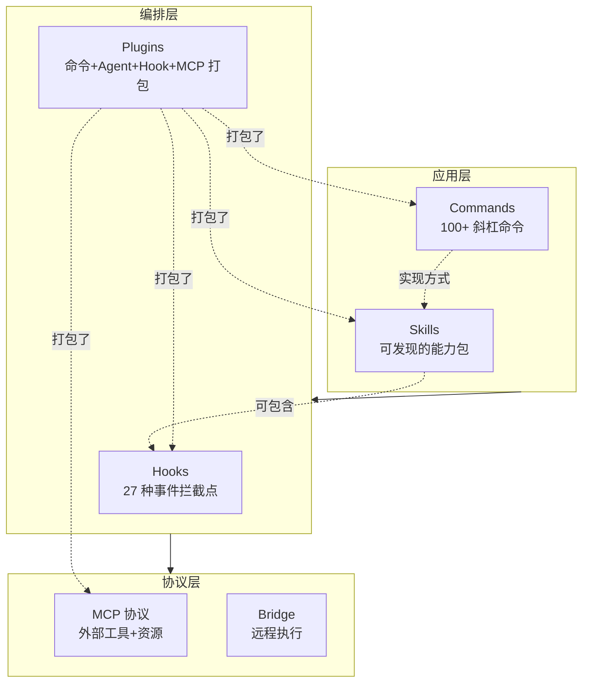

---

## 二、Hooks 系统 — 事件驱动的拦截网

### 2.1 支持的事件类型

Hooks 是 Claude Code 最细粒度的扩展点，支持 **27 种事件类型**：

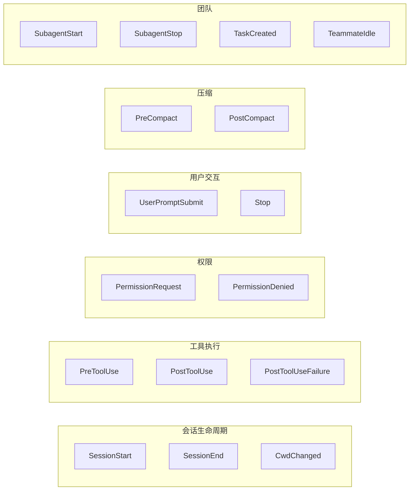

| 分类 | 事件 | 触发时机 | 典型用途 |
|------|------|---------|---------|
| **会话** | SessionStart / SessionEnd | 会话开始/结束 | 初始化/清理 |
| **工具** | PreToolUse / PostToolUse | 工具执行前/后 | 拦截、修改、审计 |
| **权限** | PermissionRequest | 权限确认前 | 自动审批 |
| **用户** | UserPromptSubmit | 用户提交消息 | 输入预处理 |
| **压缩** | PreCompact / PostCompact | 上下文压缩前/后 | 保护关键内容 |
| **团队** | SubagentStart / TeammateIdle | Agent 生命周期 | 团队编排 |
| **配置** | ConfigChange / InstructionsLoaded | 配置变更 | 动态调整 |

### 2.2 Hook 的匹配器

不是所有 Hook 都对所有事件触发。可以用**匹配器**精确控制：

```
无匹配器:  SessionStart, Stop, UserPromptSubmit
           → 任何时候都触发

工具名匹配: PreToolUse(tool_name=Bash)
           → 仅当调用 Bash 时触发

通知类型:  Notification(notification_type=permission_prompt)
           → 仅权限提示时触发

来源匹配:  SessionStart(source=startup)
           → 仅首次启动时触发（不包括 resume/clear）
```

### 2.3 五种 Hook 执行方式

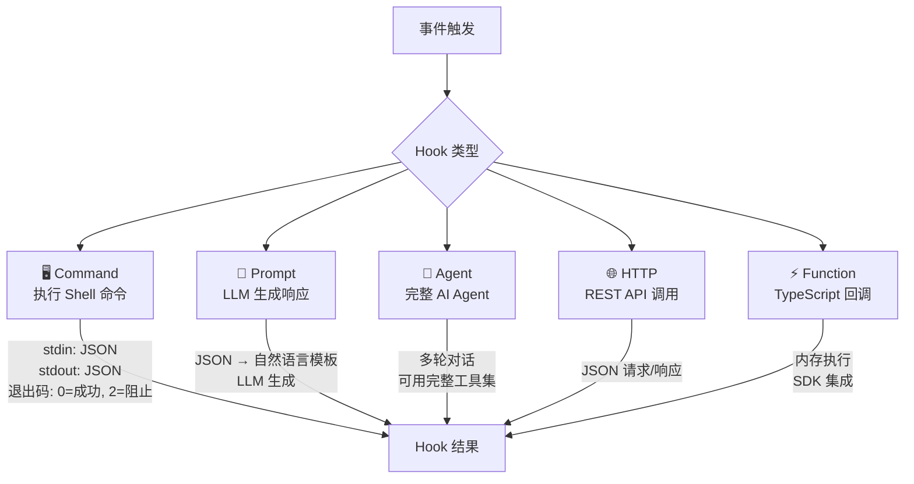

### 2.4 Hook 配置示例

```json
{
  "hooks": {
    "PreToolUse": [
      {
        "matcher": "Bash",
        "command": "node ./scripts/check-bash-safety.js",
        "timeout": 5000
      }
    ],
    "PostToolUse": [
      {
        "matcher": "FileEdit",
        "command": "prettier --write $FILE_PATH"
      }
    ],
    "Stop": [
      {
        "command": "node ./scripts/final-check.js"
      }
    ]
  }
}
```

---

## 三、Skills 系统 — 可发现的能力包

### 3.1 Skill 是什么？

Skill 就是一个 Markdown 文件，包含：
- **Frontmatter**: 元数据（名字、描述、模型、允许的工具）
- **正文**: 给 AI 的指令

```markdown
---
name: commit
description: 创建 Git 提交
progressMessage: 正在提交...
model: sonnet
allowedTools: [Bash, FileEdit]
---

请分析暂存区的更改，生成符合规范的提交消息...
```

### 3.2 Skill 的发现管道

Skills 从**六个来源**被发现和加载：

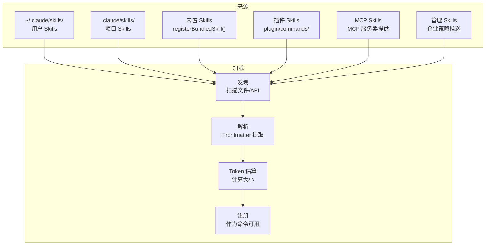

### 3.3 两种执行模式

| 模式 | 行为 | 用途 |
|------|------|------|
| **inline** | Skill 内容展开到当前对话 | 简单指令，共享上下文 |
| **fork** | 在子 Agent 中独立运行 | 复杂任务，独立 token 预算 |

### 3.4 SkillTool 的工作流

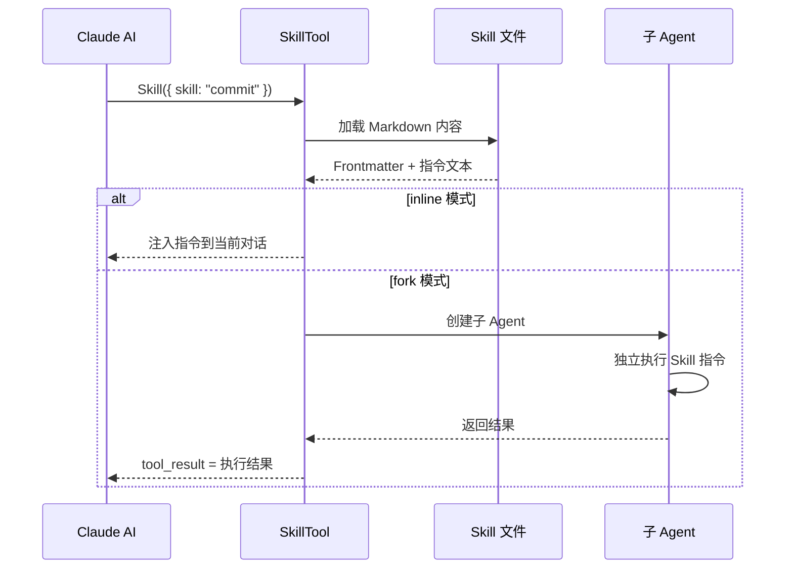

---

## 四、MCP 协议 — 标准化的能力扩展

### 4.1 MCP 是什么？

MCP (Model Context Protocol) 是一个开放协议，允许外部服务为 AI 提供**工具**和**资源**。

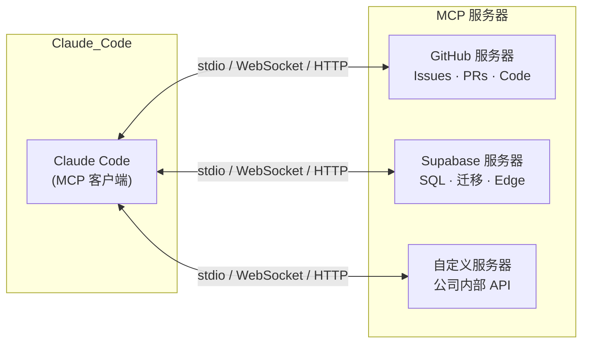

### 4.2 配置层级

```
MCP 配置来源（从低到高）:
1. 全局配置     ~/.claude/mcp.json
2. 项目配置     .mcp.json
3. 企业配置     管理策略推送
4. 插件配置     插件自带 MCP
5. 运行时配置   内存中动态添加
```

### 4.3 四种连接方式

| 连接类型 | 协议 | 适用场景 |
|---------|------|---------|
| **stdio** | 标准输入/输出 | 本地进程，最常见 |
| **WebSocket** | ws:// | 远程持久连接 |
| **HTTP** | http:// (SSE) | 云端服务 |
| **SSE** | Server-Sent Events | 单向推送 |

### 4.4 MCP 带来的能力

```
listTools()     → 发现服务器提供的工具
listResources() → 发现服务器提供的数据资源
executeToolCall() → 调用远程工具
elicitation()   → MCP 服务器请求用户输入
```

---

## 五、Plugin 系统 — 完整的能力打包

### 5.1 Plugin 目录结构

一个 Plugin 可以同时提供多种扩展：

```
my-plugin/
├── plugin.json              # 清单文件
├── commands/                # 斜杠命令
│   ├── build.md             #   /build
│   └── deploy.md            #   /deploy
├── agents/                  # 自定义 Agent
│   └── test-runner.md       #   专门跑测试的 Agent
├── hooks/                   # Hook 配置
│   └── hooks.json           #   自动格式化等
├── mcp/                     # MCP 服务器配置
│   └── mcp.json
└── output-styles/           # 自定义输出样式
```

### 5.2 Plugin 加载流程

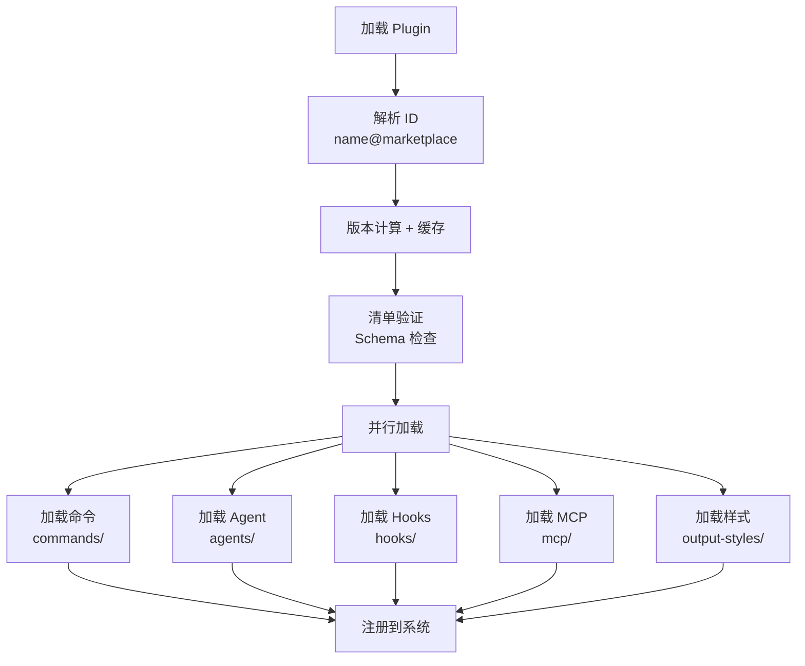

### 5.3 Plugin 来源

| 来源 | 格式 | 说明 |
|------|------|------|
| **官方市场** | `plugin-name@marketplace` | 官方维护 |
| **GitHub** | `github:owner/repo` | 社区插件 |
| **NPM** | `npm:package-name` | NPM 包 |
| **本地** | `--plugin-dir /path` | 开发调试 |

### 5.4 Hot Reload

Plugin 的 Hook 配置支持**热重载**：

```
监听策略设置变化
  ├─ 计算插件影响快照
  ├─ 如果有变化:
  │   ├─ 清除旧 Hook
  │   ├─ 注册新 Hook
  │   └─ 原子性交换
  └─ 移除已禁用插件的 Hook
```

---

## 六、Commands 系统 — 100+ 斜杠命令

### 6.1 两种命令类型

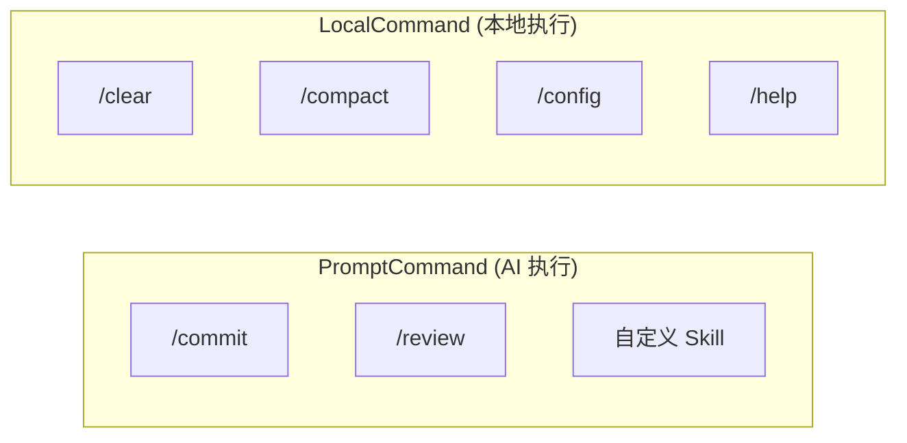

| 类型 | 执行者 | 返回类型 | 示例 |
|------|--------|---------|------|
| **PromptCommand** | AI (注入指令) | AI 生成内容 | /commit, /review |
| **LocalCommand** | 本地代码 | text / compact / skip | /clear, /config, /help |

### 6.2 命令实现模式

每个命令是 `commands/` 下的一个目录：

```
commands/
├── clear/
│   └── index.ts   → { type: 'local', call: clearHandler }
├── compact/
│   └── index.ts   → { type: 'local', call: compactHandler }
├── commit/
│   └── index.ts   → { type: 'prompt', getPromptForCommand: ... }
└── ...100+ 命令
```

### 6.3 命令执行上下文

LocalCommand 可以访问：
```
ToolUseContext        ← 工具调用能力
setMessages()        ← 修改对话历史（如 /compact）
options.theme        ← 当前主题
onChangeAPIKey()     ← 切换 API 密钥
resume()             ← 恢复会话
```

---

## 七、Plan Mode — 只看不做

Plan Mode 是一个特殊的执行模式，让 AI **提出方案但不执行**：

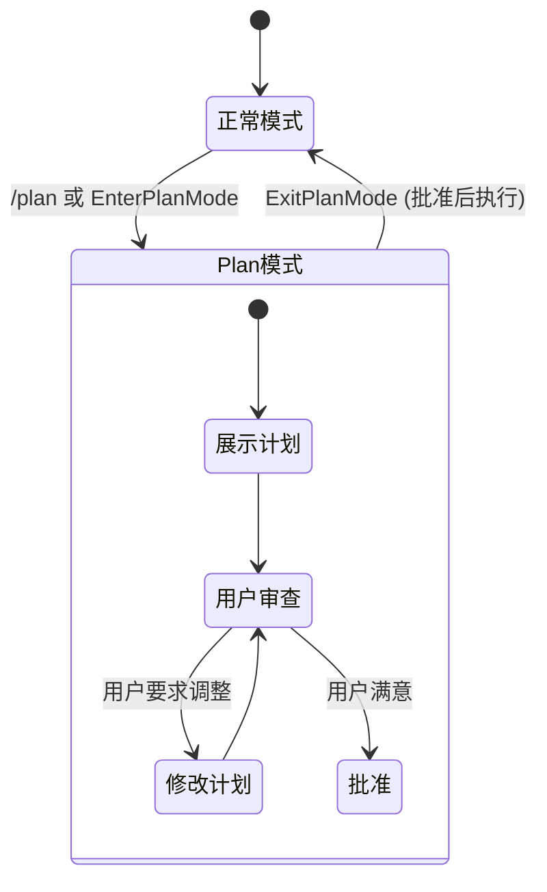

**Plan Mode 的限制**：
- AI 可以读文件、搜索代码
- AI **不能**编辑文件、执行命令
- 所有修改性操作都变成"计划描述"

---

## 八、Bridge 模式 — 远程执行

Bridge 实现了本地与远程的无缝切换：

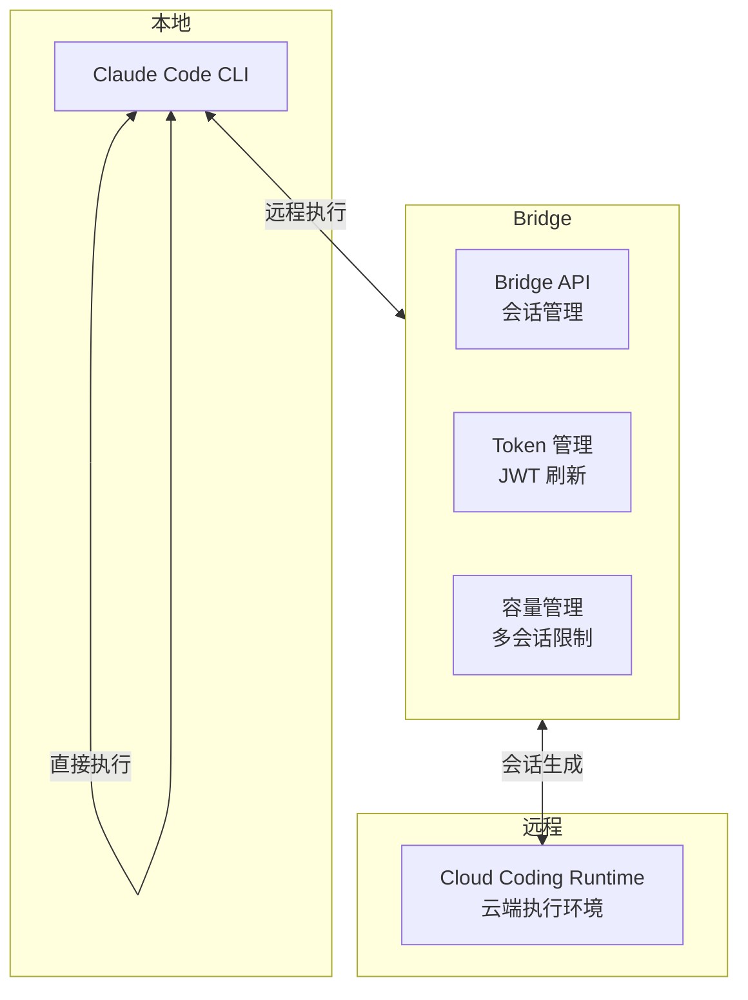

---

## 九、扩展点之间的协作

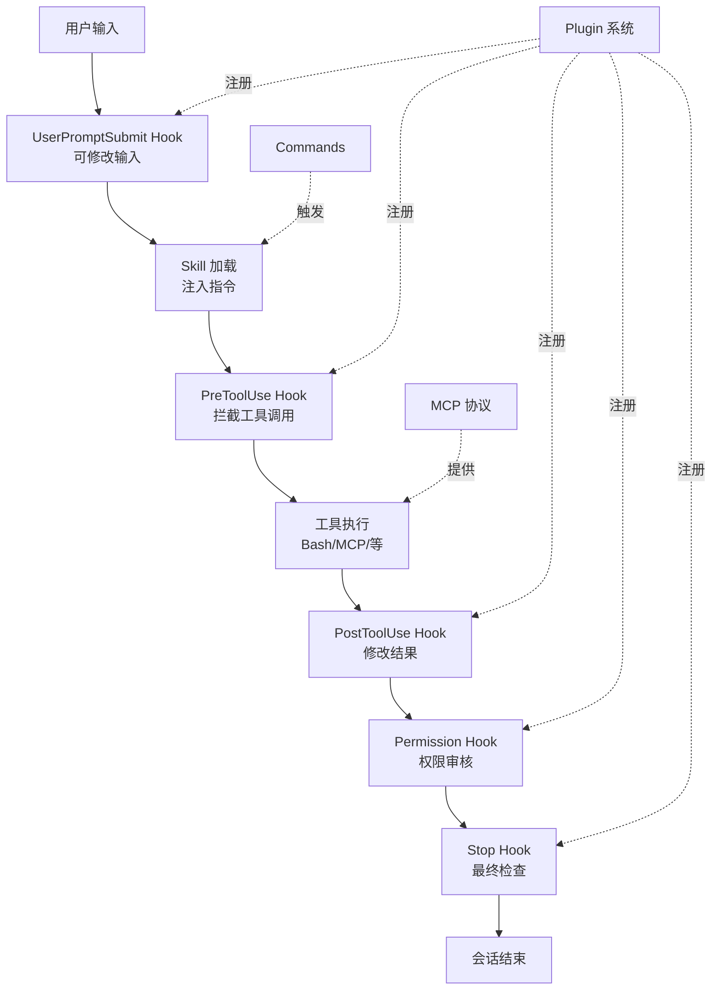

### 典型扩展场景

| 场景 | 用到的扩展点 |
|------|------------|
| 自动格式化代码 | PostToolUse Hook (FileEdit → prettier) |
| 自定义部署流程 | Skill (/deploy) + Bash 工具 |
| 集成公司内部 API | MCP 服务器 + Plugin 打包 |
| 代码审查流程 | Command (/review) + Agent Hook |
| 安全合规检查 | PreToolUse Hook + HTTP 对接审计系统 |
| 团队共享配置 | Plugin (Marketplace) + Hook 热重载 |

---

## 十、设计亮点总结

| 设计点 | 做法 | 为什么 |
|--------|------|--------|
| **27 种事件类型** | 覆盖从输入到输出的每个环节 | 任何需求都能找到合适的拦截点 |
| **5 种 Hook 执行方式** | Shell/Prompt/Agent/HTTP/Function | 适应不同技术栈 |
| **6 源 Skill 发现** | 用户/项目/内置/插件/MCP/企业 | 灵活性与管控性兼顾 |
| **Plugin 打包** | 命令+Agent+Hook+MCP 一体 | 一次安装，全部就绪 |
| **Hot Reload** | Hook 配置变更自动生效 | 无需重启 |
| **MCP 标准协议** | 开放的工具和资源扩展 | 生态无限可扩展 |
| **Plan Mode** | 只看不做 | 安全审查，渐进式信任 |
