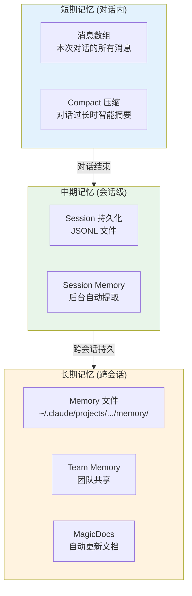
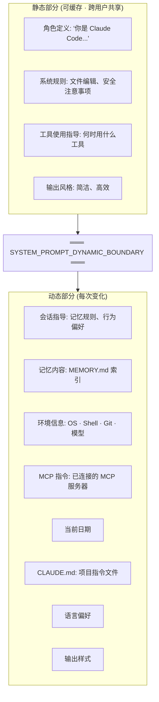
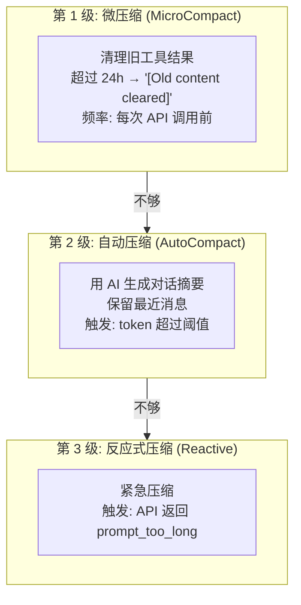
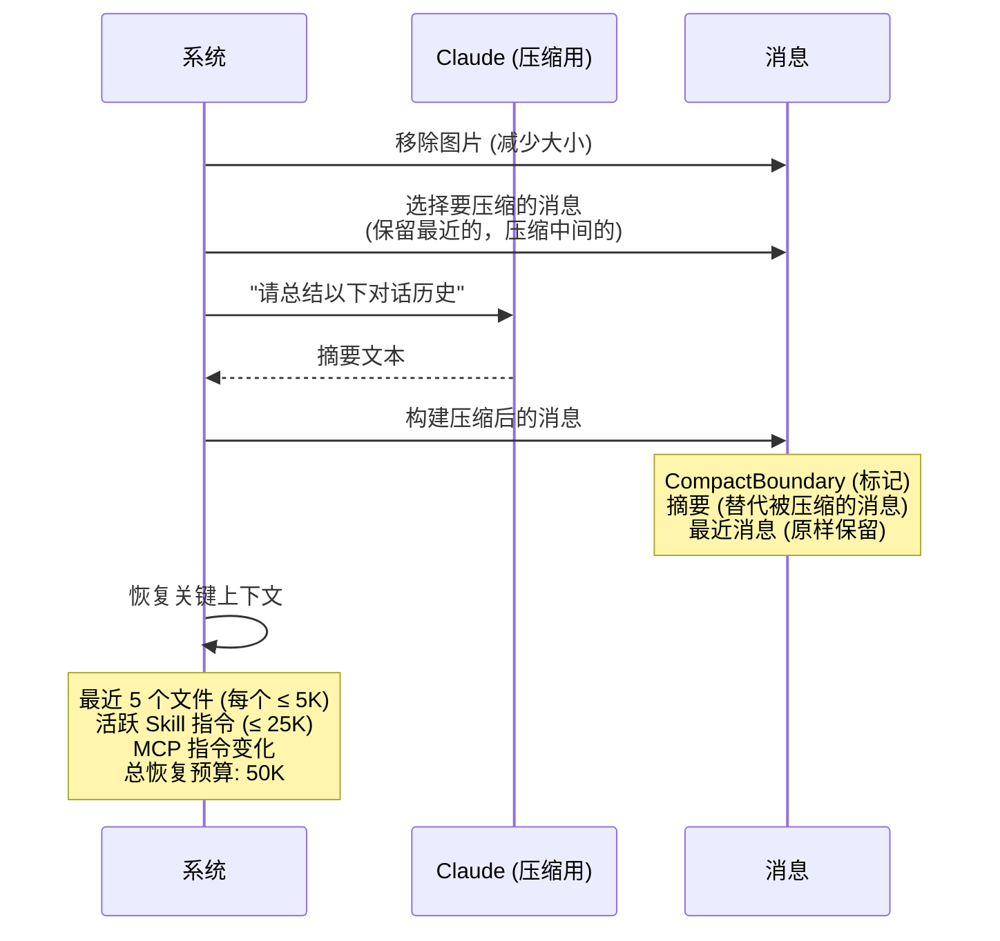
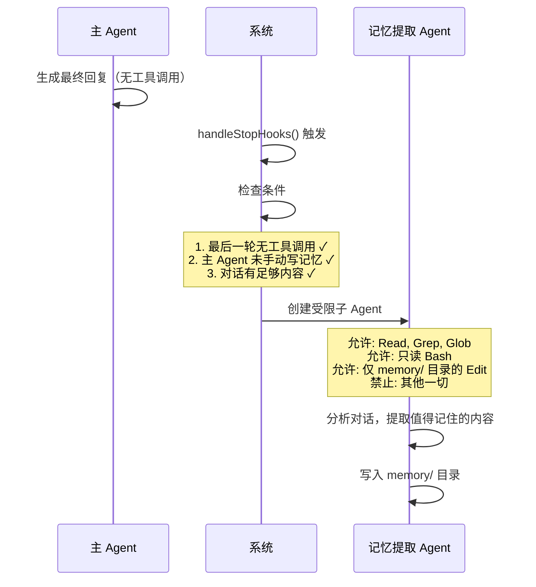
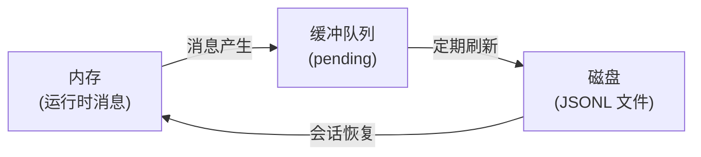
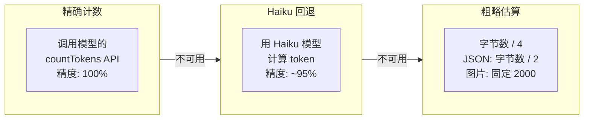
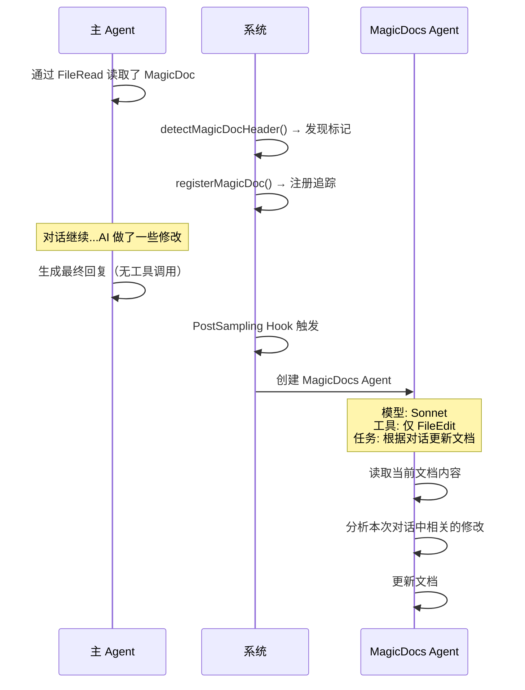

# Claude Code 上下文管理与记忆系统

> AI 的上下文窗口有限，Claude Code 通过三层记忆架构解决"智能遗忘与持久记忆"问题。

## 一、三层记忆架构



---

## 二、System Prompt 的分层构建

系统提示由静态和动态两部分组成：



### 缓存策略

| 部分 | 缓存方式 | 效果 |
|------|---------|------|
| **静态部分** | `cache_control: { type: "ephemeral", scope: "global" }` | 跨用户、跨请求复用 |
| **动态部分** | 不缓存，每轮重新计算 | 保证内容最新 |
| **MCP 指令** | `DANGEROUS_uncached`（标记为不可缓存） | 因为 MCP 连接随时变化 |

### Memoization 机制

```
systemPromptSection(name, compute)
  ├─ 对话期间缓存（同一 section 不重复计算）
  ├─ /clear 或 /compact 时清空缓存
  └─ 下次访问时重新计算

特殊: DANGEROUS_uncachedSystemPromptSection()
  ├─ 每轮都重新计算
  └─ 用于 MCP 指令（服务器随时连接/断开）
```

---

## 三、Compact 压缩机制

### 3.1 为什么需要压缩？

```
对话越来越长
  → 消息越来越多
    → Token 越来越多
      → 接近上下文窗口上限
        → 必须"遗忘"一些内容
```

### 3.2 三级压缩体系



### 3.3 自动压缩的触发阈值

```
上下文窗口 (如 200K)
├─────────────────────────────── 200K
│
├─── 阻塞线 (窗口 - 3K)         197K  ← 超过必须压缩
│
├─── 自动压缩线                  155K  ← 超过自动触发
│    (有效窗口 - 13K 缓冲)
│
├─── 错误警告线                  135K  ← 显示红色警告
│    (自动压缩线 - 20K)
│
├─── 普通警告线                  135K  ← 显示黄色警告
│
└─────────────────────────────── 0K
```

### 3.4 完整压缩流程



### 3.5 摘要包含什么？

```
AI 生成的摘要:
├─ 用户的原始目标
├─ 已完成的工作
├─ 关键决策和推理过程
├─ 相关代码片段
├─ 已知问题
└─ 仍待完成的任务
```

### 3.6 缓存微压缩 (Cached MicroCompact)

一种高级优化，避免重复发送已删除的工具结果：

```
正常微压缩: 直接替换消息内容
  → 但会破坏提示缓存

缓存微压缩: 用 cache_edits 指令删除
  → 不改变消息体，保持缓存命中
  → 通过 cache_deleted_input_tokens 节省费用
```

---

## 四、Memory 系统

### 4.1 记忆类型

| 类型 | 存储位置 | 来源 | 用途 |
|------|---------|------|------|
| **User** | `~/.claude/projects/.../memory/` | 用户/项目配置 | 个人记忆 |
| **AutoMem** | 同上 | AI 自动提取 | 对话中学到的 |
| **SessionMemory** | 会话级文件 | 后台周期提取 | 会话内学习 |
| **TeamMem** | 云端同步 | 团队共享 | 团队知识 |

### 4.2 自动记忆提取 (AutoMem)



### 4.3 Session Memory (后台周期提取)

```mermaid
flowchart TD
    START["对话进行中"] --> CHECK{"触发条件？"}
    
    CHECK -->|"token 累积 ≥ 阈值<br/>AND<br/>工具调用 ≥ 阈值"| TRIGGER["触发提取"]
    CHECK -->|"token 累积 ≥ 阈值<br/>AND<br/>最后一轮无工具调用"| TRIGGER
    CHECK -->|"未满足"| WAIT["等待"]
    WAIT --> START
    
    TRIGGER --> FORK["后台 fork 子 Agent"]
    FORK --> BUILD["构建更新提示"]
    BUILD --> EXTRACT["提取会话记忆"]
    EXTRACT --> SAVE["保存到文件"]
    
    Note over FORK: 不中断主对话
```

### 4.4 Memory 注入到提示

记忆文件在每轮对话时被加载并注入系统提示：

```
系统提示:
  ...
  [memory section]
  你有一个持久的记忆系统在 ~/.claude/projects/.../memory/
  
  当前记忆索引 (MEMORY.md):
  - [用户角色](user_role.md) — 高级工程师，专注后端
  - [代码风格](feedback_style.md) — 不要加注释，保持简洁
  - [项目背景](project_auth.md) — 正在重构认证模块
  ...
```

---

## 五、Session 持久化

### 5.1 三级持久化



### 5.2 JSONL 存储格式

```json
{"timestamp":1711929600000,"sessionId":"abc","uuid":"msg-1","type":"user","content":{...}}
{"timestamp":1711929601000,"sessionId":"abc","uuid":"msg-2","type":"assistant","content":{...}}
{"timestamp":1711929602000,"sessionId":"abc","uuid":"msg-3","type":"system","content":{...}}
```

### 5.3 设计选择

| 决策 | 选择 | 原因 |
|------|------|------|
| **格式** | JSONL (行 JSON) | 追加写入，无需读-改-写 |
| **原子性** | appendFile | 进程崩溃不会损坏已写的行 |
| **大小限制** | Tombstone 50MB | 防止 OOM |
| **恢复** | parentUuid 链 | 支持分支和恢复 |

---

## 六、Token 估算与预算管理

### 6.1 三种估算方式



### 6.2 模型的输出 Token 配置

| 模型 | 默认输出 | 上限 |
|------|---------|------|
| Opus 4.6 | 64K | 128K |
| Sonnet 4.6 | 32K | 128K |
| Opus 4.5 | 32K | 64K |
| Sonnet 4 | 32K | 64K |
| Haiku 4 | 32K | 64K |

### 6.3 有效上下文窗口

```
有效窗口 = 上下文窗口 - max_output_tokens

例如 Opus 4.6 (1M 上下文):
  有效 = 1,000,000 - 64,000 = 936,000 tokens

例如 Sonnet 4.6 (200K 上下文):
  有效 = 200,000 - 32,000 = 168,000 tokens
```

### 6.4 Token 预算特性

用户可以指定 AI 的 token 花费预算：

```
用户: "+500k"  → AI 至少使用 500K tokens
用户: "spend 2M tokens" → AI 至少使用 2M tokens

行为:
├─ Token 预算是硬最小值
├─ 如果 AI 提前停止，系统自动继续
└─ 超过预算后才允许停止
```

---

## 七、Team Memory 同步

### 7.1 同步架构


### 7.2 同步语义

| 操作 | 行为 | 冲突处理 |
|------|------|---------|
| **Pull** | 服务器内容覆盖本地 | 服务器赢 |
| **Push** | 仅上传 hash 不同的条目 | Delta 更新 |
| **Delete** | 本地删除不传播 | Pull 时恢复 |

### 7.3 安全措施

```
上传前安全扫描:
├─ scanForSecrets() → 检测 API 密钥、Token、密码
├─ 发现秘密 → 阻止上传
└─ 返回 SkippedSecretFile 列表

大小限制:
├─ 单条目: 250KB
├─ 单次 PUT: 200KB (分批上传)
└─ 服务器最大条目数: 动态配置
```

---

## 八、MagicDocs — 自动更新文档

### 8.1 什么是 MagicDoc？

在 Markdown 文件顶部加一个特殊标记，就变成了 MagicDoc：

```markdown
# MAGIC DOC: API Design Guide
*Keep this document updated with new API patterns and design decisions.*

## Current Patterns
...
```

### 8.2 自动更新流程



### 8.3 设计特点

| 特点 | 说明 |
|------|------|
| **被动触发** | 只有在 AI 读取了 MagicDoc 后才注册 |
| **异步更新** | 不中断主对话 |
| **最小权限** | 只能用 FileEdit，不能执行命令 |
| **条件执行** | 最后一轮无工具调用时才触发 |

---

## 九、上下文管理的关键设计模式

### 模式 1: 提示缓存的二分法

```
静态 (不变) → 加缓存标记 → 跨请求复用
─── 分界线 ───
动态 (每次变) → 不缓存 → 每次重新计算

效果: 静态部分约 80% 的内容可以复用
```

### 模式 2: Forked Agent 与权限隔离

```
主 Agent (完整权限)
  └─ Fork 子 Agent (受限权限)
     ├─ AutoMem: 只能读 + 写 memory/
     ├─ SessionMemory: 后台更新，不中断
     └─ MagicDocs: 只能 FileEdit

效果: 后台任务不会影响主对话安全
```

### 模式 3: 压缩后的前向恢复

```
压缩 = 遗忘 + 恢复

遗忘: 中间消息被摘要替代
恢复: 最近 5 个文件 + Skill 指令 + MCP 指令

效果: 压缩不丢关键上下文
```

### 模式 4: 三级持久化

```
内存 → 缓冲队列 → 磁盘 (JSONL)

效果: 崩溃时最多丢失缓冲中的几条消息
```

---

## 十、设计亮点总结

| 设计点 | 做法 | 为什么 |
|--------|------|--------|
| **提示缓存二分** | 静态/动态分界，最大化缓存 | 降低 API 成本 |
| **三级压缩** | 微压缩→自动压缩→反应式 | 渐进应对，避免过度遗忘 |
| **压缩后恢复** | 恢复关键文件和指令 | 压缩不等于全忘 |
| **后台记忆提取** | Fork Agent 异步处理 | 不中断主对话 |
| **权限隔离** | 记忆 Agent 只能写 memory/ | 安全边界清晰 |
| **MagicDocs** | 自动保持文档最新 | 减少手动维护 |
| **团队记忆同步** | Delta push + 秘密扫描 | 高效且安全 |
| **JSONL 存储** | 追加写入，原子性 | 崩溃安全 |
| **Token 预算** | 用户可指定最小花费 | 控制 AI 的"努力程度" |
