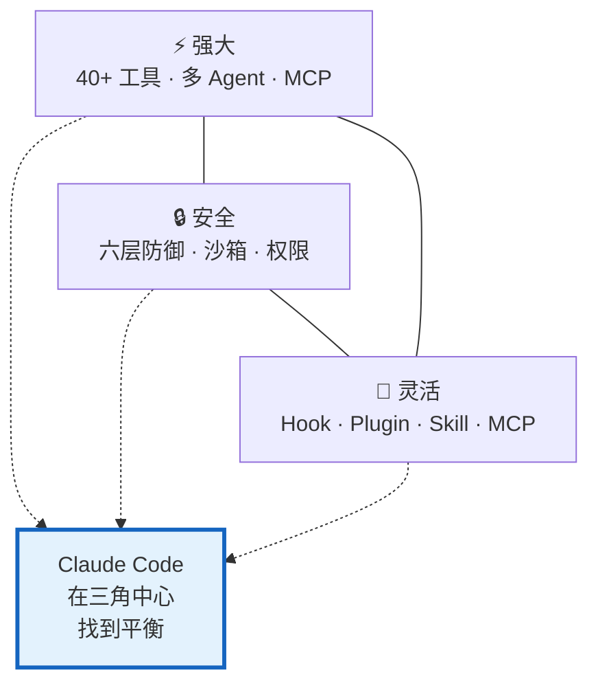
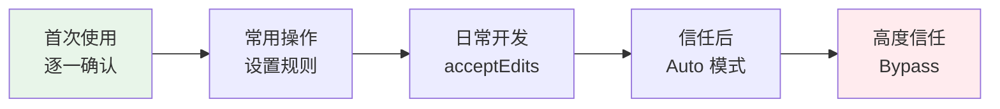
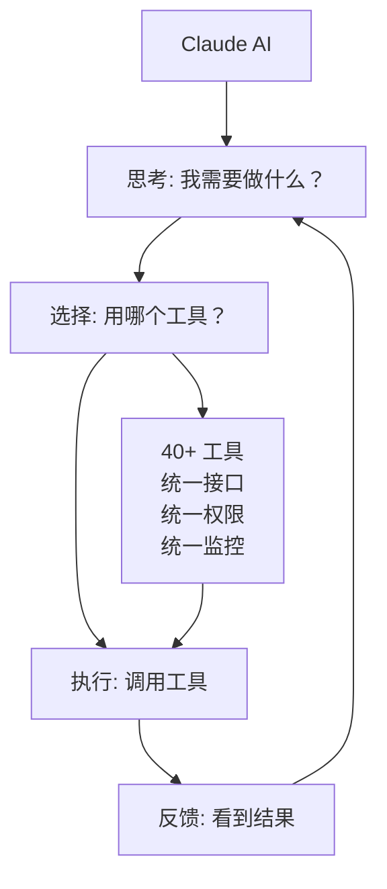
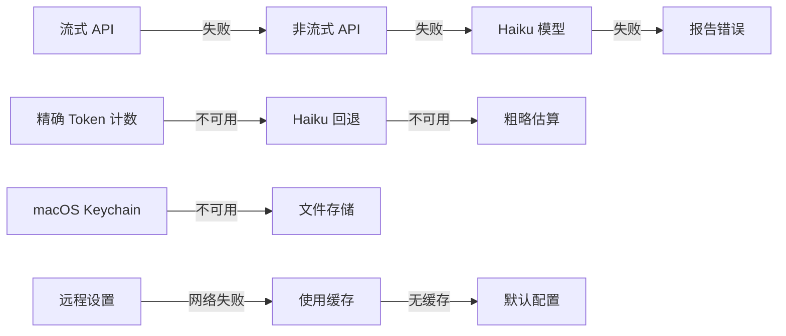
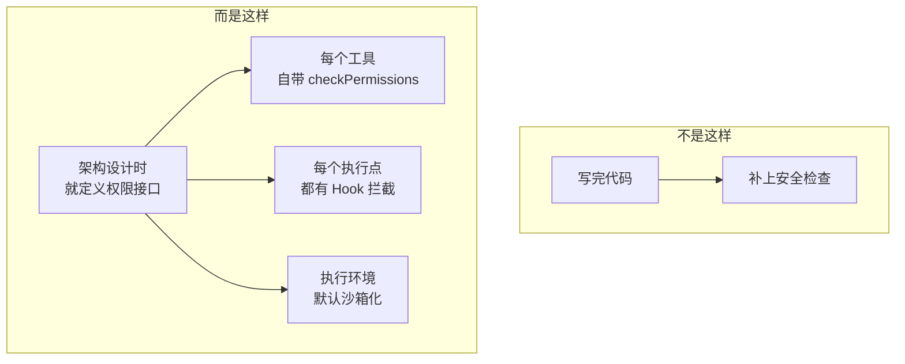
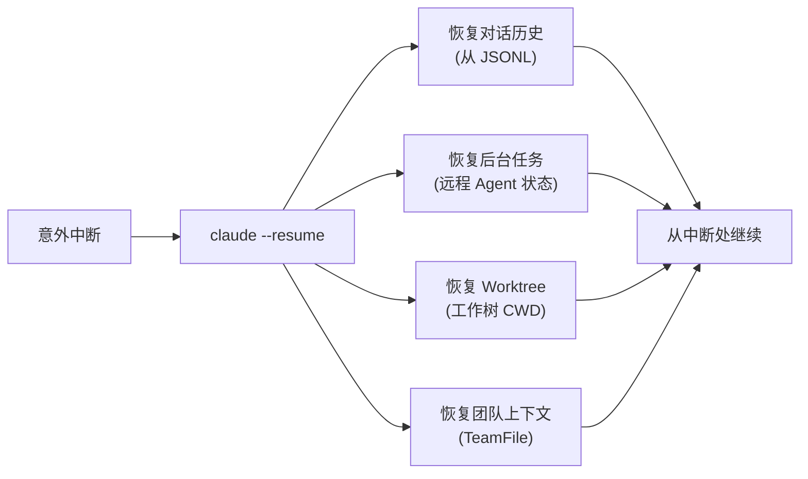
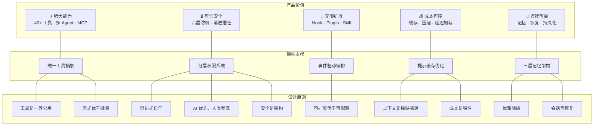

# Claude Code 产品设计哲学

> 从 1905 个源文件、40+ 工具、27 种 Hook 事件、六层安全防线中，提炼出的顶级 AI Agent 产品思维。

## 一、核心设计理念

Claude Code 的所有架构决策，归根结底服务于一个目标：

> **让 AI 成为开发者可信赖的编程伙伴——既足够强大，又足够安全，还足够灵活。**

这三个要素形成了一个"不可能三角"，Claude Code 的设计就是在三者之间找到最优平衡：



---

## 二、十大设计原则

### 原则 1: 渐进式信任

**不是一上来就给 AI 最大权限，而是让用户逐步建立信任。**



| 体现 | 做法 |
|------|------|
| 权限模式梯度 | default → acceptEdits → auto → bypass |
| 首次运行信任对话 | 检测风险项，提示用户 |
| Plan Mode | 先看方案，再决定是否执行 |
| "总是允许" 按钮 | 逐条积累信任规则 |

**设计洞察**: 安全不是二元开关，而是一个可调节的梯度。用户自行决定信任级别。

---

### 原则 2: AI 优先，人类兜底

**让 AI 尽可能自主完成任务，但在关键决策点留给人类最终控制权。**

```
日常操作: AI 自主完成 (读文件、搜索、只读命令)
          ↓
敏感操作: AI 提议，人类确认 (编辑文件、执行命令)
          ↓
危险操作: AI 不能做，必须人类操作 (sudo、删除)
```

| 体现 | 做法 |
|------|------|
| 安全白名单 | FileRead/Grep 等只读操作自动放行 |
| 权限确认 | 写文件/执行命令需要确认 |
| 危险检测 | rm/sudo 等命令额外警告 |
| 中断能力 | 用户随时可以中断 AI 操作 |

**设计洞察**: AI 自主处理常规操作，关键决策权保留给用户。

---

### 原则 3: 工具是一等公民

**不是"AI + 附加工具"，而是"工具驱动的 AI"。**



| 体现 | 做法 |
|------|------|
| 统一 Tool 接口 | 所有工具共享相同的生命周期 |
| buildTool() 工厂 | 新工具自动获得权限/Hook/遥测 |
| ToolSearch 延迟加载 | 工具定义不全部占用上下文 |
| MCP 扩展 | 无限扩展工具能力 |

**设计洞察**: 工具定义了 AI 的能力边界，工具系统的质量直接决定了 Agent 的实际能力。

---

### 原则 4: 流式优于批量

**用户看到"正在发生"比"等一会"体验好得多。**

```
❌ 批量模式: 用户输入 → 等待 30 秒 → 一次性输出全部
✅ 流式模式: 用户输入 → 立即开始输出 → 逐字显示 → 工具实时进度
```

| 体现 | 做法 |
|------|------|
| API 流式调用 | 所有模型调用默认流式 |
| 工具进度回调 | 长时间工具显示实时进度 |
| 后台 Agent 进度 | 每 30 秒 AI 生成摘要 |
| Task 通知 | 后台任务完成时即时通知 |

**设计洞察**: 流式输出将用户的"等待"转化为"观看进展"，显著提升感知响应速度。

---

### 原则 5: 优雅降级，永不中断

**每个环节都有回退方案，确保用户始终能继续工作。**



| 体现 | 做法 |
|------|------|
| API 三级回退 | 流式 → 非流式 → Haiku |
| Token 估算回退 | 精确 → Haiku → 字节估算 |
| 认证存储回退 | Keychain → 明文文件 |
| 远程设置回退 | 网络 → 缓存 → 默认 |
| 压缩三级回退 | 微压缩 → 自动压缩 → 反应式 |
| max_output_tokens 恢复 | 减少参数，最多重试 3 次 |

**设计洞察**: 对用户而言，底层故障不应中断工作流。系统应自动寻找可用路径。

---

### 原则 6: 上下文是稀缺资源

**像管理内存一样管理上下文窗口。**

```
上下文预算分配:
├─ 系统提示: ~10-20K tokens (固定开销)
├─ 工具定义: 按需加载 (ToolSearch 优化)
├─ 对话历史: 动态管理 (Compact 压缩)
├─ 工具结果: 大结果 → 磁盘 + 预览
├─ 记忆注入: 精选最相关的
└─ 输出预留: max_output_tokens
```

| 体现 | 做法 |
|------|------|
| ToolSearch | 工具定义不全部加载 |
| 提示缓存二分 | 静态部分缓存，不重复发送 |
| 三级压缩 | 渐进式管理对话长度 |
| 大结果持久化 | 50K+ 结果 → 磁盘 + 预览 |
| 微压缩 | 旧工具结果自动清理 |
| 压缩后恢复 | 恢复关键上下文，不全忘 |

**设计洞察**: 上下文窗口是有限资源，需要精细管理——保留高价值信息，及时释放低价值内容。

---

### 原则 7: 可扩展优于可配置

**不是给 100 个配置项，而是给 5 个扩展点。**

```
配置 (有限):              扩展 (无限):
├─ 200 个 settings       ├─ 27 种 Hook 事件
├─ 固定的行为             ├─ Plugin 体系
└─ 选项越多越复杂         ├─ Skill 系统
                          ├─ MCP 协议
                          └─ 自定义 Agent
```

| 体现 | 做法 |
|------|------|
| Hook 系统 | 25+ 事件 × 5 种执行方式 |
| Plugin 打包 | 命令+Agent+Hook+MCP 一体化 |
| MCP 开放协议 | 任何人都能提供工具和资源 |
| Skill 系统 | 一个 Markdown 文件就是一个能力 |
| 自定义 Agent | agents/ 目录放 Markdown 即可 |

**设计洞察**: 配置项覆盖已知需求，扩展点覆盖未知需求。后者的上限远高于前者。

---

### 原则 8: 安全是架构，不是补丁

**安全不是事后加的，而是从第一天就融入架构。**



| 体现 | 做法 |
|------|------|
| Tool 接口内置权限 | `checkPermissions()` 是必须实现的方法 |
| 安全默认值 | `isReadOnly=false`, `isConcurrencySafe=false` |
| 六层纵深防御 | 规则→Hook→分类器→沙箱→UI→企业 |
| Deny 优先 | 同级别中拒绝规则优先于允许规则 |
| 不可变权限上下文 | 每次更新返回新对象，防竞态 |

**设计洞察**: 安全漏洞的成本极高。将安全融入框架层面，比依赖开发者自觉遵守更可靠。

---

### 原则 9: 成本是产品特性

**Token 不是免费的，成本管理是产品体验的一部分。**

```
成本优化手段:
├─ 提示缓存: 静态部分跨请求复用 → 大幅减少输入 token 费用
├─ 缓存穿透: 子 Agent 复用父 Agent 的缓存 → 子任务几乎零额外缓存成本
├─ ToolSearch: 按需加载工具描述 → 减少每次请求的 token
├─ 微压缩: 删除旧工具结果 → 减少历史 token
├─ 结果持久化: 大结果不走 API → 避免超大消息的 token 开销
├─ 成本追踪: 实时显示花了多少钱 → 用户可控
└─ Token 预算: 用户可指定花费上限
```

| 体现 | 做法 |
|------|------|
| `cache_control` | 系统提示静态部分标记为可缓存 |
| CacheSafeParams | 子 Agent 字节级复用父 Agent 提示 |
| Bootstrap 成本追踪 | `totalCostUSD` 实时累计 |
| /cost 命令 | 随时查看当前花费 |
| Token 预算 | `+500k` 指定最小花费 |

**设计洞察**: 用户为每个 token 付费。降低单次交互成本，直接影响使用频率和留存率。

---

### 原则 10: 会话是可恢复的

**断电、崩溃、误关都不应该丢失工作进展。**



| 体现 | 做法 |
|------|------|
| JSONL 追加写入 | 崩溃不损坏已写的消息 |
| Session 恢复 | `--resume` 完整恢复 |
| Worktree 状态持久化 | 磁盘保存工作树状态 |
| 远程 Agent 存活 | 云端 Agent 超越本地会话 |
| Sidechain 转录 | 子 Agent 对话独立保存 |

**设计洞察**: 对话上下文的价值不亚于代码本身。丢失一小时的对话上下文意味着重建成本和思路中断。

---

## 三、架构取舍清单

每个设计决策都有取舍。以下是 Claude Code 做出的关键取舍：

| 取舍 | 选择了 | 放弃了 | 原因 |
|------|--------|--------|------|
| **状态管理** | 两层（全局+会话） | 单一 Store | 不同生命周期的数据需要不同管理方式 |
| **工具加载** | 延迟加载 (ToolSearch) | 全部预加载 | 上下文窗口是稀缺资源 |
| **安全默认** | Fail-closed（默认拒绝） | Fail-open（默认允许） | 安全事故的成本远高于多一次确认 |
| **消息存储** | JSONL 追加 | SQLite/数据库 | 追加写入更简单、更抗崩溃 |
| **子 Agent 隔离** | AsyncLocalStorage | 独立进程 | 轻量、共享内存、可缓存穿透 |
| **压缩策略** | 三级渐进 | 一次性压缩 | 避免过度遗忘 |
| **权限系统** | 多层规则+AI分类器 | 简单白名单 | 平衡安全性和使用便利 |
| **插件系统** | 目录约定（Markdown） | DSL/Schema | 降低创建门槛 |
| **提示缓存** | 静态/动态二分 | 全部缓存 | 动态内容变化频繁，缓存命中率低 |
| **团队通信** | 异步邮箱 | 同步 RPC | 解耦，支持离线消息 |

---

## 四、产品设计启示

从 Claude Code 的源码中，可以提炼出以下对 AI 产品设计的普适启示：

### 1. "AI + 工具" 是 Agent 的本质

> AI 本身只能"思考"和"说话"。加上工具，它才能"做事"。
> 
> Claude Code 的核心不是"更好的对话"，而是"更好的工具调用"。

### 2. 安全是商业产品的门票

> 没有安全体系的 AI Agent，不敢给企业用。
> 
> 六层防御看似过度设计，但每一层都有存在的理由。

### 3. 扩展性决定生态

> 一个封闭的工具不会有社区。
> 
> Hook + Plugin + MCP + Skill 让 Claude Code 变成了一个平台。

### 4. 成本优化是竞争力

> 谁的 API 调用更省钱，谁就能让用户用得更多。
> 
> 提示缓存、延迟加载、缓存穿透——每个优化都直接影响用户账单。

### 5. 会话连续性是信任基础

> 如果 AI 经常"忘记"上下文或"丢失"进度，用户就不会把重要任务交给它。
> 
> Memory + Compact + Resume 构成了"可靠的 AI 伙伴"的基础。

---

## 五、一张图总结



---

## 六、文档索引

本系列共 8 篇文档，每篇聚焦一个主题：

| # | 文档 | 核心内容 |
|---|------|---------|
| 01 | [整体架构设计](01-整体架构设计.md) | 五层架构、启动流程、模块职责、状态管理 |
| 02 | [对话与数据流](02-对话与数据流.md) | 消息类型、对话循环、API 交互、流式处理 |
| 03 | [工具系统](03-工具系统.md) | 工具定义、调用生命周期、延迟加载、MCP 集成 |
| 04 | [多 Agent 协作](04-多Agent协作机制.md) | 子 Agent、Task 系统、团队协作、Worktree 隔离 |
| 05 | [安全与权限](05-安全与权限策略.md) | 六层防御、权限模式、沙箱、企业管控 |
| 06 | [流程编排与扩展](06-流程编排与扩展机制.md) | Hook、Skill、MCP、Plugin、Command 系统 |
| 07 | [上下文与记忆](07-上下文管理与记忆系统.md) | Compact 压缩、Memory 系统、Session 持久化 |
| 08 | [产品设计哲学](08-产品设计哲学.md) | 十大设计原则、架构取舍、产品启示 (本文) |
